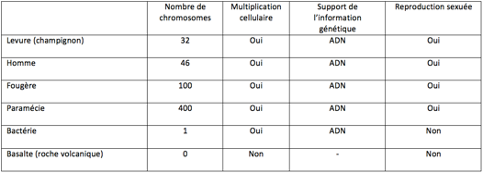
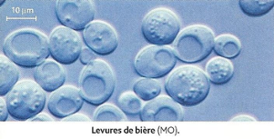
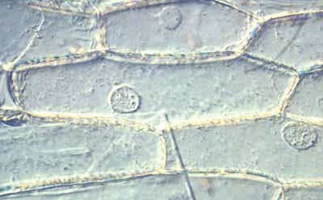
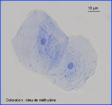

# Sujet DNB #1 - De l'origine des espèces. 

En 1859, Charles Darwin suggère que tous les êtres vivants actuels ou fossiles ont une origine commune et dérivent d’un même **ancêtre commun**. 

David, élève en classe de troisième, est convaincu que les animaux possèdent bien une origine commune avec l’Homme mais il n’est pas certain que ce soit vrai pour les plantes ou autres organismes vivants.

---

### **A l'aide de vos connaissances et des documents à disposition, trouvez des arguments qui confirment l'origine commune de toutes les espèces.**

### **Votre réponse se fera sous forme de paragraphe argumenté, en citant le ou les documents utilisés.**

### **Vous pouvez découper et coller les documents du sujet sur votre copies afin de les légendés au besoin.**
---

||
|:---:|
|*Document 1 :* Tableau comparatifs de différents éléments|

||
|:---:|
|*Document 2 :* Observation microscopique d'une levure (champignon)|

||
|:---:|
|*Document 3 :* Observation microscopique d'une cellule végétale|

||
|:---:|
|*Document 4 :* Observation microscopique d'une cellule buccale humaine|

|Le **D**ernier **A**ncêtre **C**ommun **U**niversel est le plus récent organisme dont sont issues toutes les espèces vivant actuellement sur Terre. Le terme en anglais *Last Universal Common Ancestor* a pour acronyme LUCA.     LUCA aurait été actif il y a 3,3 à 3,8 milliards d'années. Il ne doit pas être confondu avec le premier organisme vivant. C'était un organisme assez complexe, déjà issu d'une longue évolution marquée par la sélection naturelle|
|:---:|
|*Document 5 :* L.U.C.A.|

---

<u>Espèce :</u> regroupe les êtres vivants ayant des caractéristiques communes, qui sont interféconds et dont les descendants sont à leur tour interféconds.

<u>Interfécond :</u> dont le mâle et la femelle peuvent donner naissance à de nouveaux individus qui peuvent à leur tour se reproduire. 