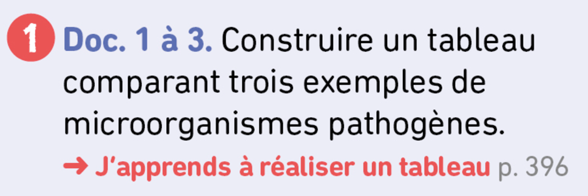
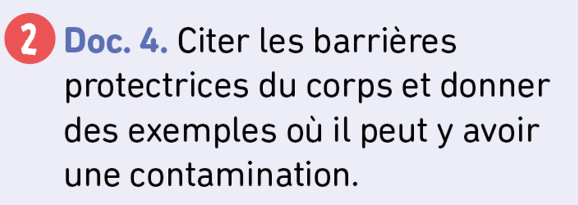

<!-- paginate: true -->

# Leçon 1 : Vous avez peur des petites bêtes ? 

---
 

**Microorganisme :** organisme vivant visible uniquement au microscope, taille inférieure à 100 µm.

**µ :** unité micro, µm = micromètre = 0,000 001 m =  10^-6 m

---
## Activité 1 et 2 p 116

---

  

---
    

---

  

---

--- 
     

|    |  *Candida albicans* | *Clostridium tetani*   |   *Ebolavirus zaïre* |
|----|----|----|----|
|  **Lieu de vie**  |  Muqueuse  | Sang   |  Cellules  |
|  **Symbtômes**  |  Rougeurs, douleurs  |  Paralysie  |  Fièvre, fatigue  |
|  **Maladie**  |  Mycose  |   Tétanos |  Ebola  |

---

---

---

---

