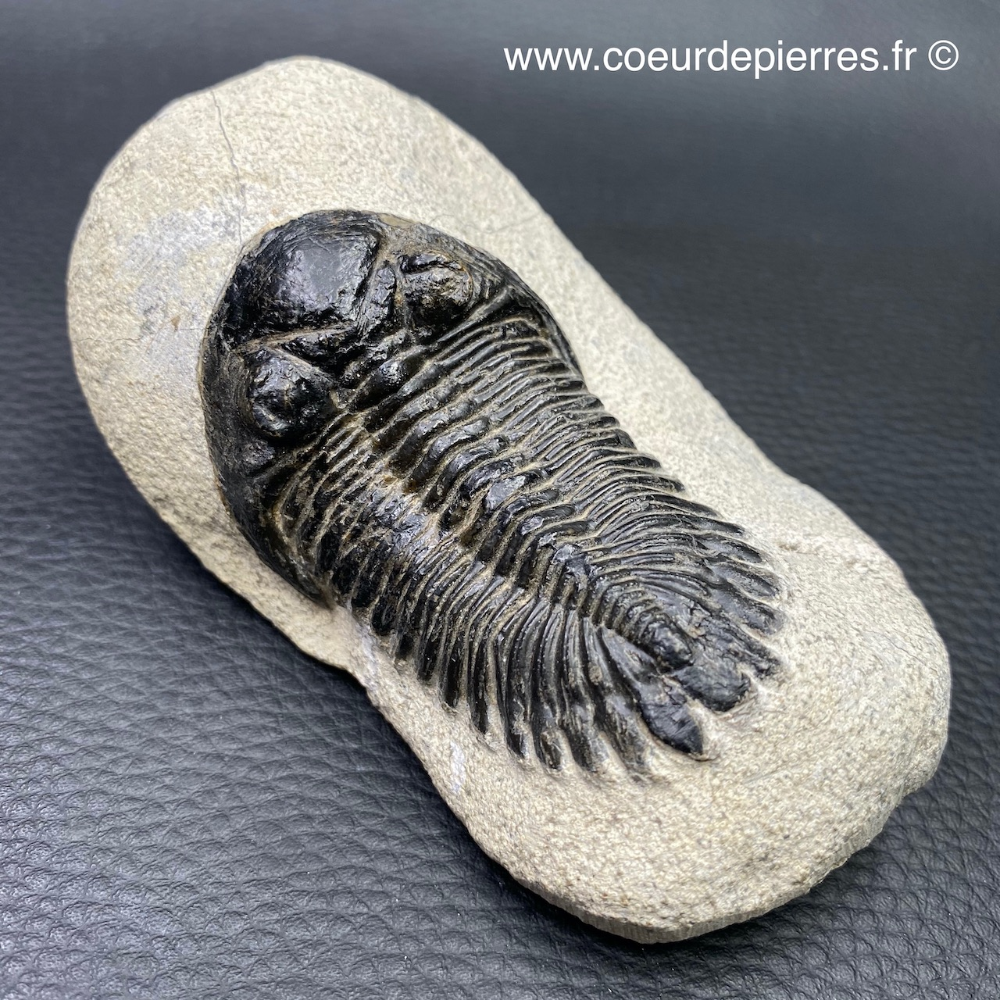

<!-- paginate: true -->

# Leçon 13 : Histoire de la Terre et Evolution

---

L'histoire de la Terre couvre approximativement 4,5 milliards d'années (4 567 000 000 années), depuis la formation de la Terre à partir de la nébuleuse solaire jusqu'à maintenant.

Les origines de la vie, qui remonteraient à environ 3,5 à 3,8 milliards d'années, demeurent incertaines.

---

L'échelle des temps géologiques est un système de classement chronologique utilisé, notamment en géologie, pour dater les événements survenus durant l'histoire de la Terre.

Chaque jour, les techniques changent ou deviennent plus précises, les échelles doivent ainsi être périodiquement mises à jour, les âges devenant plus précis.

---

<embed src="../Fiches/FriseSVT.pdf" width=1200 height=800 type='application/pdf'/>

---
# Ère Primaire

Le Paléozoïque est une ère géologique qui s'étend de -540 à -250 millions d'années. Cette ère est parfois appelée ère Primaire.

Son début correspond classiquement à l'apparition de nombreux fossiles à coquilles dures. Cette ère s'achève par une extinction massive.

---

Cette ère est composée du : **Cambrien, Ordovicien, Silurien, Dévonien, Carbonifère, Permien**

Cette ère est aussi appelée l'ère des poissons, car les espèces dominantes sur Terre sont des poissons et coquillages.
Le fossile caractéristique est le trilobite.

---

---
## Ère Secondaire 

Le Mésozoïque appelé anciennement Ère secondaire, est une ère géologique qui s'étend de − 250 à − 65 Ma, au cours de laquelle apparaissent des espèces de mammifères et de dinosaures.

Sa limite correspond à l'extinction du Crétacé.

L'ère secondaire comprend les trois périodes suivantes:
**Trias, Jurassique, Crétacé**

---

---

L'ère tertiaire est la troisième ère géologique et la plus récente sur l'échelle des temps géologiques, de -65 Ma à nos jours.
L'ère tertiaire se divise en trois périodes géologiques : **Paléogène, Néogène, Quaternaire**
