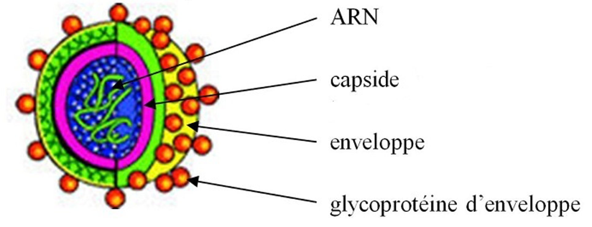

<!-- paginate: true -->

# Leçon 14 : L'organisme face au milieu extérieur

---

Comment l'organisme se protège-il des menaces des microorganismes extérieur ? 

---

## Les principaux types de microorganismes

---

  
---

---

---

## Rappels

**Eucaryote :** Cellule possédant un noyau

**Procaryote :** Cellule ne possédant pas de noyau 

---

Une muqueuse est une surface interne humide de notre corps en contact avec l’extérieur.

La plupart des micro-organismes ne nous font rien, d’autres nous sont utiles comme les bactéries dans le tube digestif mais d’autres encore provoquent des maladies : 

On parle de **Pathogène.** 

Rappel : Une bactérie est un être vivant unicellulaire. Un virus est un parasite obligatoire de cellule sans noyau, ni capacité à se reproduire seul.

---

## Définitions

---

<u>Asepsie :</u> Méthode de prévention, éliminant les microorganismes, pathogène ou non. 
<u>Antisepsie :</u> Méthode de désinfection d’une plaie, éliminant les microorganismes juste après la contamination, afin d’éviter l’infection. 
<u>Contamination :</u> On parle de contamination lorsqu’un microorganismes traverse les barrières du corps. 
<u>Contamination directe :</u> contamination entre deux individus
<u>Contamination indirecte :</u> contamination entre deux individus à l’aide d’un intermédiaire. 

---

<u>Infection :</u> Multiplication importante des microorganismes après la contamination, caractérisé par une inflammation. 
<u>Inflammation :</u> Caractérisée par les symptômes suivants : Rougeur, Douleur, Chaleur
<u>Préservatif :</u> dispositif en latex, permettant une asepsie lors des rapports sexuels, est également un moyen de contraception. 
<u>Antibiotiques :</u> substance chimique uniquement efficace sur les bactéries. 
<u>Pathogène :</u> se dit d’un microorganisme qui provoque une maladie. 

---

<iframe width="1100" height="800" src="https://www.youtube.com/embed/YxQyaDML-zg" frameborder="0" allow="accelerometer; autoplay; clipboard-write; encrypted-media; gyroscope; picture-in-picture" allowfullscreen></iframe>
