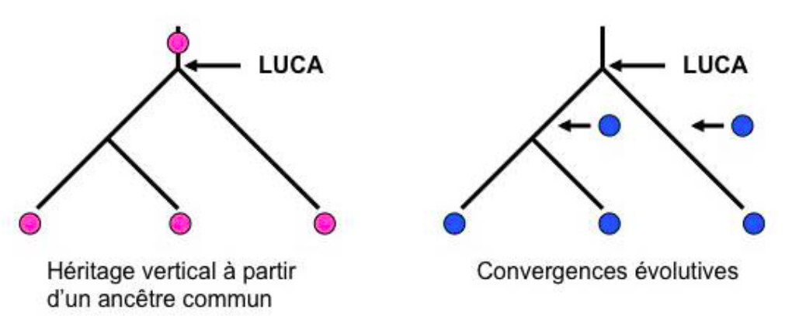

<!-- paginate: true -->

# L3 : LUCA 

---

## Activité sur feuille

En groupe, répondez à la question : **Qui était LUCA ?**

---

## Correction

---

LUCA *(Last Universal Common Ancestor)* est notre dernier ancêtre commun universel, il possède des caractères communs avec tous les êtres vivants.

LUCA est apparu il y a environ 2,8 Ga. LUCA n'est pas la **première cellule** apparue sur Terre mais **la plus proche de tous les êtres vivants actuels.**

LUCA est un être théorique.

---
## Comment prouver que LUCA est notre ancêtre à tous ? 

---

L'apparition de ces caractères dans chacune des 3 branches du vivant **(Bactérie,** **Archées,** **Eucaryote)** n'a pas pu se faire de manières identiques dans les 3 branches en même temps, ces caractères ont forcément été hérités d'un ancêtre commun.

Certains de ces caractères sont communs à tous les êtres vivants comme par exemple l'ADN, l'organisation cellulaire.

---

## Quand a t-il vécu? 

LUCA étant un organisme vivant, **il est postérieur à l'origine de la vie.** La vie est apparue il y a au moins **2,8 milliards d'années,** il est donc très difficile d'avancer une date précise sur l'âge de LUCA.

En effet, plus on remonte dans le temps, plus les traces de vie anciennes sont rares et difficiles à analyser.

---

Même si des organismes avaient vécu à cette époque, il serait très difficile de déterminer s'il s'agit de LUCA, de ses ancêtres ou de ses descendants.

---

## Sa carte d'identité

LUCA possède forcément certains caractères qu'il a légué à sa descendance :

-    La cellule

-    l'ADN

-    La machinerie cellulaire (*le métabolisme*)

 
---
## Pour résumer 

LUCA est un être **théorique,** nous savons qu’en tant que dernier ancêtre commun il partage certains **caractères** avec les êtres vivants actuels. Nous ignorons toujours s’il était **eucaryote** ou **procaryote.**

---

[Retour à la liste des leçons](liste.html)