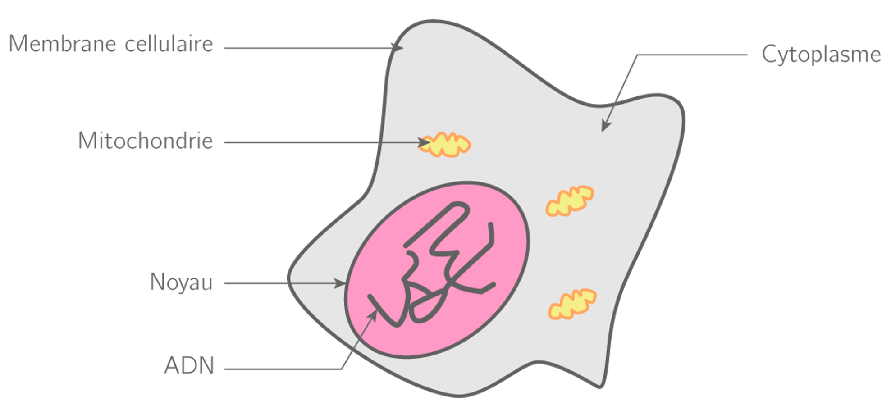

<!-- paginate: true -->

# L6 : La cellule

--- 

Donnez votre propre définition de cellule. 

--- 

## Définitions

<u>Cellule :</u> unité **fonctionnelle** et **structurelle** du vivant, un être vivant est composée au moins d’**une cellule**. Elle est composée d’une **membrane** et d’un **cytoplasme** au minimum. 

---

<u>Cellule eucaryote :</u> Cellule possédant un noyau (nous)

<u>Cellule procaryote :</u> Cellule ne possédant pas de noyau (bactérie)

<u>Organisme unicellulaire :</u> organisme composé d’une cellule unique

<u>Organisme pluricellulaire :</u> organisme composé de plusieurs cellules

---

---

