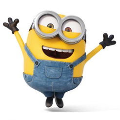

<!-- paginate: true -->

# L7 : Les caractères

--- 

Activité : Questions 1 et 2 page 184

--- 

---

---

---

| *Homo sapiens*                      | *Tapirus terrestris* | *Canis lupus*    | 
| ---------------------------------- | -------------------------- | ------------- |
| - Bipède                            | - quadrupède | - quadrupède
| - Omnivore                          | - insectivore | - carnivore
| - Cheveux                           | - poils | - poils
| - Nez                               | - groin | - museau
| - 1m75                              | - 40 cm | - 40 cm
| - Yeux orienté vers l’avant         | - Yeux périphériques | - yeux vers l'avant
| - 2 oreilles                        | - 2 oreilles | - 2 oreilles

---

| *Homo sapiens*                       | *Tapirus terrestris* | *Canis lupus*    | 
| ---------------------------------- | -------------------------- | ------------- |
| - 5 doigts / main                   | - 3 doigts à l'avant, 2 à l'arrière  | - 4 doigts
| - Pouce opposable                   | - pas de pouce opposable | - pas de pouce opposable
| - Langage                           | - pas de langage articulé | - pas de langage articulé

---

| *Homo sapiens*                     | *Tapirus terrestris* | *Canis lupus*    | 
| ---------------------------------- | -------------------------- | ------------- |
| - Poils                             | - poils | - poils
| - Cortex cérébral                   | - cortex cérébrale | - cortex cérébral
| - Sexé                              | - sexé | - sexé
| - Peau nue                          | - pas de peau nue | - pas de peau nue
| - Pas de queue                      | - pas de queue | - queue
                               
---

Il existe des caractères communs entre deux espèces, mais aussi des caractères propres à chaque espèces. 

On observe une variabilité d’un même caractère au sein d’une espèce. 

---

Un caractère est une particularité d’un individu utilisable pour le définir et l’individualiser d’autres espèces ou d’autres individus de la même espèce.

Des caractères propres à certaines espèces sont dits **interspécifiques**,  alors que des caractères propres à certaines individus d’une même espèce sont dits **intraspécifiques**. 

---

Il existe 2 types de caractères : 

* Partagés (commun à au moins deux espèces, ou commun à deux individus) 
* Individuels (propre à une espèce ou propre à un seul individu)

---

Les caractères peuvent être **acquis** (au cours de la vie) ou **héréditaires** (transmis des parents)

---

### On définit par **phénotype** l’ensemble des caractères visibles d’un individu. 

---

## Donnez le phénotype de Bob 

