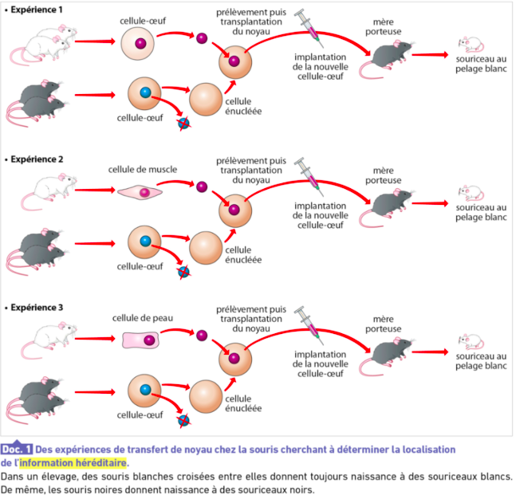
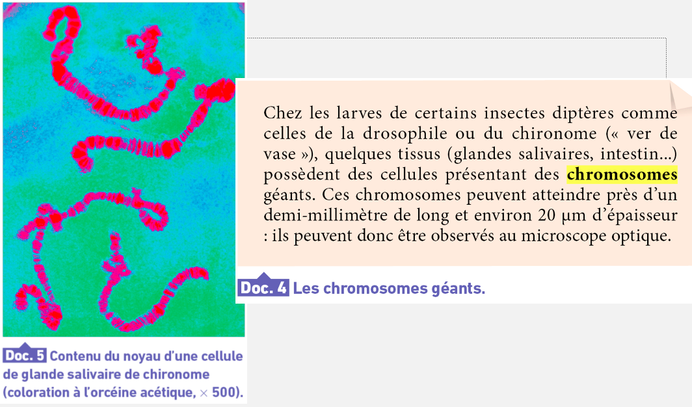
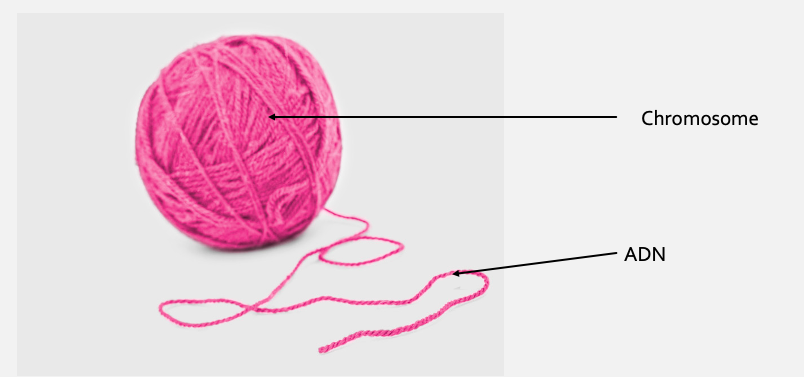
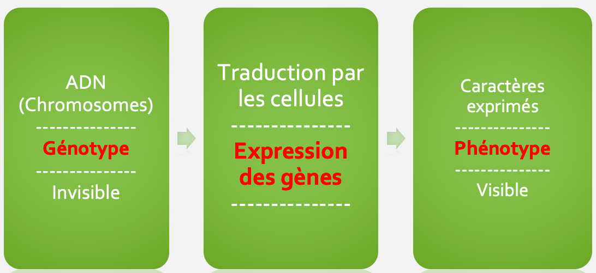

<!-- paginate: true -->

# L8 : Les chromosomes et l’ADN

---

Activité Guidée : Pages 186/187
A l’aide des documents Expliquez l’origine du support des caractères héréditaires.  

---

---

 

---

L’ADN (**A**cide **D**ésoxyribo**N**ucléïque) est une molécule porteuse de l’information génétique. 

Cette information est chimique. Le métabolisme du corps va traduire cette information en caractère. 

**Les chromosomes sont fait d’ADN.**

---

---

