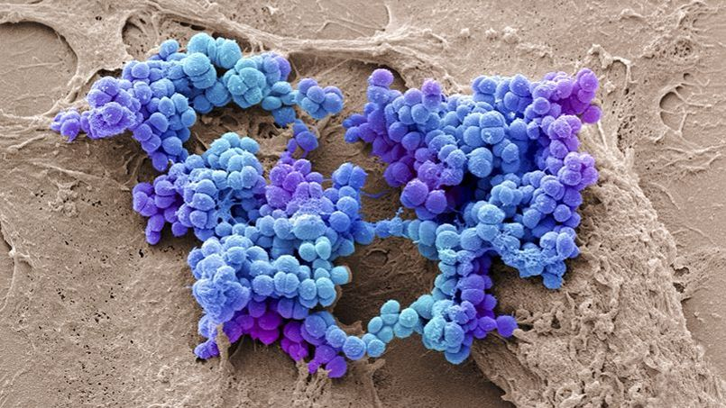
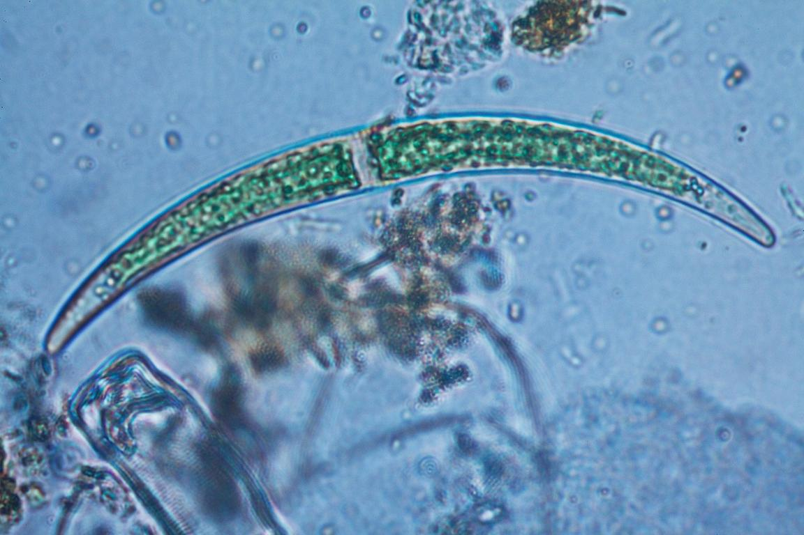
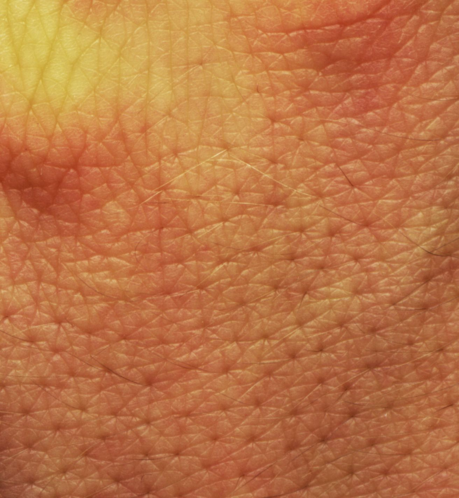
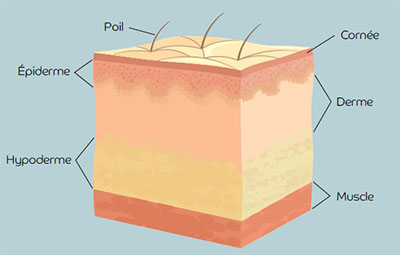

<!-- paginate: true -->

# Consignes : 

Bonjour, bienvenue dans cet oral type Brevet. 

Cet oral contient des choses à ne pas faire, d'autres à faires... Soyez critiques, prenez des notes. 

C'est un oral de 5 min. 

---

# Les microorganismes et la peau

---

La **peau** humaine héberge une multitude de microorganisme, des **bactéries**, des **champignons** ou encore des **virus**. Certains de ces microorgnaismes sont des **pathogènes**.

Un **microorganisme** est un organisme dont la taille est inférieur à **100µm**, et qui n'est donc visible qu'avec un microscope. 

---

## La peau

---

La peau constitue l’organe le plus grand du corps humain : elle représente 16 % de son poids total. 

Elle est composée de plusieurs couches de tissus, elle forme une barrière de protection de l’organisme contre le milieu extérieur. 

---

Elle est constituée de plusieurs couches de tissus :

- L’épiderme, la couche superficielle

- Le derme, couche intermédiaire

- L’hypoderme, couche profonde

---

### L'épiderme

L’épiderme est un tissu de revêtement semi-perméable (c'est à dire que l'eau peut passer au travers). Il est composé de trois types de cellules :

- *Kératinocytes*, remplis de kératine et de lipides

- *Mélanocytes*, qui produisent la mélanine responsable de la pigmentation de la peau

- *Cellules de langherans*, qui participent du système immunitaire de la peau

---

## Qu'est ce qu'un microorganisme ? 

* Plus petit que 100 µm
* bactéries
* virus
* champignons
* acariens...

---

Il existe plusieurs interactions entre des microorganismes et notre peau. 

