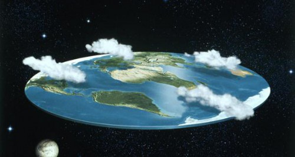
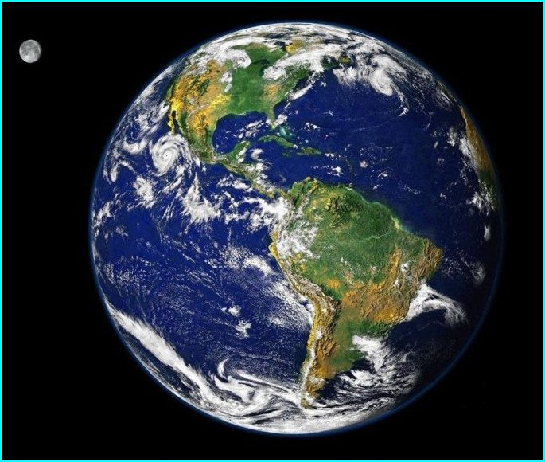
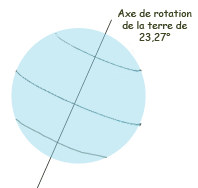
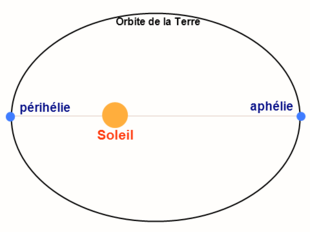
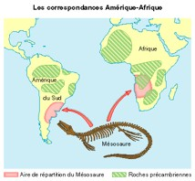
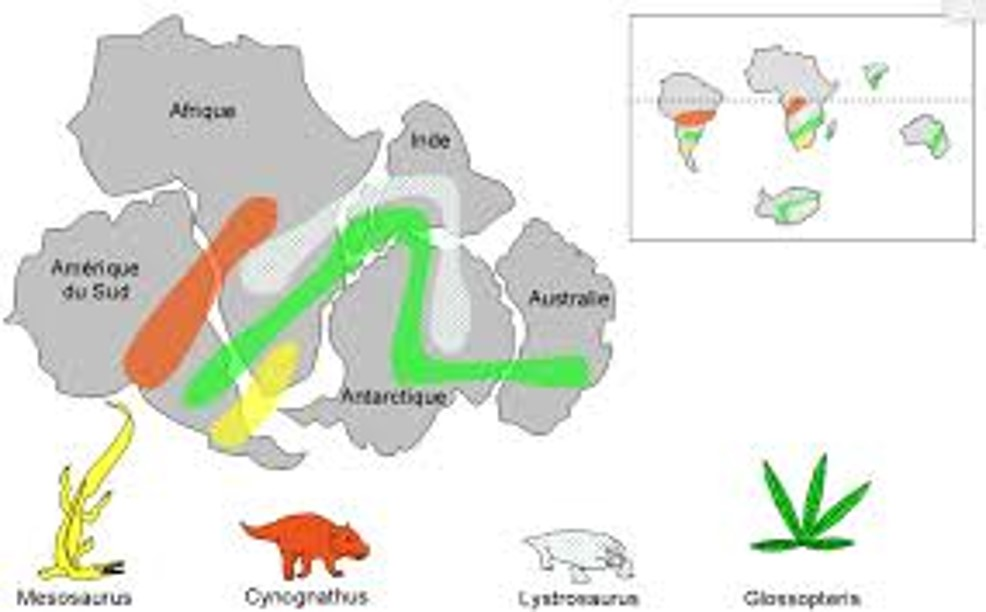

<!-- paginate: true -->

# L1 : La Terre est une planète active

---

---

---

La Terre a une forme d’**ellipsoïde aplatie**. C’est a dire que c’est une sphère, qui s’aplatie aux pôles, à cause de sa rotation. 

---

- La Terre tourne sur elle-même selon un axe de 23°. 
- Elle tourne sur elle-même en 24 h, c’est ce qu’on appelle : une **journée**.
- La Terre tourne autour du soleil.
- L’orbite est une **orbite ellipsoïde**. 
- Elle tourne autour du soleil en **365,25 jours**
- 1 année = 365 jours
- 1 année bissextile (1 / 4 ans) = 366 jours

---

--- 

---

- **L’aphélie :** correspond au point de l’orbite terrestre où la Terre est la plus éloignée du soleil. 

- **La Périhélie :** correspond au point de l’orbite terrestre où la Terre est la plus proche du soleil. 

---

<iframe width="1200" height="800" src="https://www.youtube.com/embed/FTzmqjDNMmM" title="YouTube video player" frameborder="0" allow="accelerometer; autoplay; clipboard-write; encrypted-media; gyroscope; picture-in-picture" allowfullscreen></iframe>

--- 

## La tectonique des plaques ? 

---

---

## Rapide histoire de la tectonique des plaques

**Wegener** publie en 1915 la première édition de son livre *La Genèse des continents et des océans* dans lequel il propose une nouvelle théorie associant géophysique, géographie et géologie. 

Celle-ci a été imaginée en voyant se disloquer des glaces de mer, et en comparant les fossiles des côtes africaines et américaines. 

---

---

---

## Activité page 365-366

---

Les données GPS mettent en évidence les **déplacements** **horizontaux** des plaques à la surface de la planète. 

Ainsi certaines plaques se rapprochent **(convergence),** d’autres s’écartent **(divergence)** et enfin certaines coulissent **(faille transformante).** 

Ces mouvements relatifs entraînent des **contraintes** au niveau des frontières de plaques à l’origine des séismes et des **éruptions volcaniques.** 

---

[Retour à la liste des leçons](liste.md)
