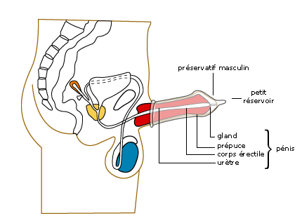
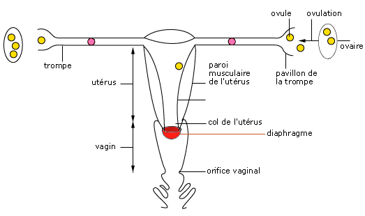
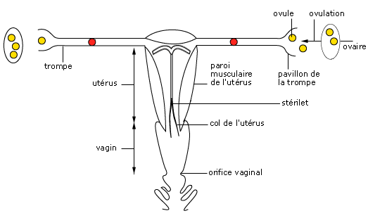

<!-- paginate: true -->

# Leçon 13 : Contraception

--- 

## Faisons la liste des moyens de contraception

--- 

- Préservatif
- Pillules
- Implants
- Diaphragme
- Gel spermicide
- Injections
- Stérilisation

---

## Préservatif masculin

Le préservatif masculin est un étui souple en latex qui recueille le sperme lors de l’éjaculation et empêche les spermatozoïdes de rencontrer l’ovule dans les voies génitales féminines.
>**Il joue aussi un rôle essentiel dans la prévention des maladies sexuellement transmissibles (MST) comme le vih.**

---

---

## Préservatif feminin

Le préservatif féminin est constitué d’un tube en polyuréthane souple, dont une extrémité est fermée et placée sur le col de l’utérus à l’aide d’un anneau souple. L’autre extrémité, ouverte, reste à l’extérieur de la vulve. Un préservatif neuf doit être utilisé à chaque relation.
>**Le préservatif féminin constitue également une protection contre la contamination par les MST.**

---

## Pilules

Les pilules contraceptives sont prescrites à la femme, après examen médical, pour bloquer l’ovulation. Ces pilules, à base d’œstrogène et de progestérone, hormones produites par l’ovaire, modifient le cycle ovarien. Elles bloquent l’ovulation et agissent sur l’endomètre qui ne peut plus accueillir l’embryon. La prise de pilules empêche la fécondation et la nidation.
Ces pilules, sous formes de mini-doses essentiellement, sont optimisées pour un meilleur respect de la physiologie féminine et pour une meilleure contraception.

---

## Implants

Il représente un nouveau dispositif contraceptif. Il consiste à placer sous la peau un bâtonnet hormonal dans la face interne du bras. Ce bâtonnet délivre de façon continue de la progestérone qui bloque l’ovulation.

---

## Diaphragme

Le diaphragme est constitué d'une membrane en caoutchouc souple, tendue sur un cercle métallique rigide. Il bloque la progression des spermatozoïdes dans les voies génitales féminines. Pour améliorer son efficacité, qui est limitée, le diaphragme est souvent enduit d’une crème spermicide.

---

---

## Les stérilets

Le stérilet est un dispositif en plastique souple et en cuivre, de petite taille. Sa mise en place, au niveau de l’utérus, est réalisée par le médecin pour deux ans. Sa présence rend l’endomètre inapte à la nidation d'un embryon. En France, seules les femmes ayant déjà eu des enfants et qui n’en désirent plus utilisent le stérilet, en raison d’un risque possible d’infection ou de grossesse extra-utérine pouvant causer une stérilité.

---

---

## Les fausses contraceptions

---

## Pilule du lendemain

En dehors de l’utilisation du stérilet, lorsque les rapports sexuels ne sont pas, ou sont mal protégés, il peut y avoir un risque de grossesse non désirée. Dans ce cas, il existe une intervention possible en administrant une dose massive d’hormones. Celles-ci vont agir sur l’appareil reproducteur en retardant l’ovulation, en immobilisant les spermatozoïdes dans les voies génitales ou en modifiant l’endomètre provoquant ainsi l’évacuation d’un éventuel embryon.

---

Mais cette intervention ne peut être efficace que si elle se fait dans les 12 heures qui suivent le rapport non protégé. Elle se fait sous surveillance médicale, car elle est physiologiquement et psychologiquement éprouvante pour la personne qui l’utilise. Cette intervention doit être strictement réservée aux cas d’urgence. Elle ne peut pas remplacer une méthode contraceptive préventive et responsable.

---

## Les croyances populaires

Il existe d'autres méthodes contraceptives, mais celles-ci sont à éviter, car leur efficacité est extrêmement limitée. Il s'agit du retrait, de la méthode de la température, de la toilette vaginale, de la détermination de la période de fécondité par le calcul des jours.

