<!-- paginate: true -->

# Leçon 16 :  Le système nerveux

--- 

## La vue, l'ouïe, l'odorat, le goût et le toucher : comment le corps humain reçoit-il les informations sensorielles ?

---

--- 

Le **système nerveux** se compose : 

- du cerveau
- des nerfs
- de la moëlle épinière

---

Le cerveau doit recevoir et traiter des informations issues du monde extérieur afin de **réagir**, **communiquer** et **entretenir** la bonne santé et la **sécurité** du corps. 

---

La majeure partie de ces informations provient des **organes** **sensoriels** : les **yeux**, les **oreilles**, le **nez**, la **langue** et la **peau**. 

---

Des **cellules** et des **tissus** **spécialisés** de ces organes reçoivent des stimuli bruts et les traduisent en des signaux que le cerveau peut alors utiliser. 

---

Les **nerfs** relaient ces signaux vers le cerveau, qui les interprète comme la vue (**vision**), l'ouïe (**audition**), l'odorat (**olfaction**), le goût (**gustation**) et le toucher (**perception tactile**).

---

Il existe deux types de nerfs : 

1. Les nerfs sensitifs
2. Les nerfs moteurs

--- 

---

---

## La vue

---

La vue est le sens qui permet de réagir à l'environnement distant au moyen des rayonnements lumineux.

L'œil est l'organe de la vue, mais la vision, c'est-à-dire la perception visuelle, implique des zones spécialisées du cerveau. Le cortex visuel synthétise les influx nerveux transmises par le nerf optique pour identifier des formes, des couleurs, des textures, des reliefs.

La plupart des espèces vivantes animées possèdent un sens de la vue, dont les caractéristiques, variées, dépendent de leur environnement.

---

---

## L'ouïe

---

Chez les mammifères, l'oreille est l'organe principal de l'ouïe.

Il existe le tympan qui vibre selon les vibrations, cette vibration est transformé en information nerveuse, transmise au cerveau. 

---

---

## L'odorat

---

L'olfaction ou l'odorat est le sens qui permet d'analyser les substances chimiques volatiles (odeurs) présentes dans l’air.

L’olfaction est la fonction sensorielle qui correspond à la perception des substances odorantes. 

Cette fonction est assurée par la muqueuse olfactive qui couvre environ 10 % soit 2 cm2 de la surface totale de la cavité nasale. Des cellules glandulaires, présentes dans la muqueuse et dans la sous-muqueuse, sécrètent un mucus tapissant l'intérieur du nez, ce qui assure un lavage permanent de la muqueuse.

---

Cette muqueuse olfactive est composée de neurones olfactifs.

Ces neurones sont des neurones spécialisés : ils présentent des cils à l'extrémité qui baignent dans la couche de mucus tapissant la cavité nasale. Lors de la présence d'une odeur, ces cils captent les molécules et les neurones envoient un signal nerveux au cerveau. 

---

---

## Le goût

---

Le goût, ou la gustation, est le sens qui permet d'identifier les substances chimiques par l'intermédiaire de récepteurs situés sur la langue.
Il joue un rôle important dans l'alimentation en permettant d'analyser la saveur des aliments. La perception du goût est intimement liée à l'odorat et le terme « goût » englobe ces deux sens dans le langage courant. 

---

---

## Le toucher

---

Le toucher donne des informations par contact de la peau avec la surface des corps solides et accessoirement par exposition aux fluides (eau, air, etc.). Une bonne partie de ces informations sont spécifiques : la température ou la consistance ne pourraient être connues autrement.

C'est dans les différents corpuscules tactiles, structures plus ou moins spécialisées de la peau, qu'il faut chercher les prémices des différentes informations élaborées par le système nerveux.

---

