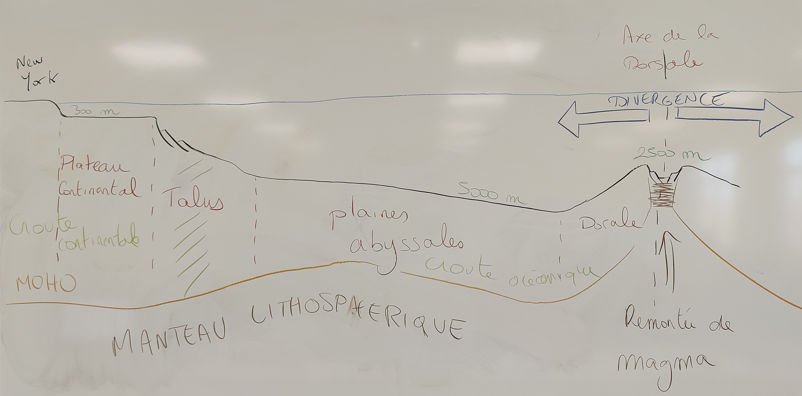

<!-- paginate: true -->

# Leçon 4 : Naissance d'un océan

---

---

- En géologie, une dorsale, appelée aussi crête médio-océanique, est une chaîne de montagnes sous-marine, que l'on rencontre dans tous les océans. 

- Une dorsale se présente sous la forme d'un système de reliefs formant une chaîne, de part et d'autre d'un rift central marqué. 

- Le réseau de ces dorsales est continu et s’étend sous les océans sur près de 60 000 à 80 000 km.

---

### Schéma de la structure de l'océan

---

--- 

- Pour la tectonique des plaques, une dorsale océanique est une frontière de divergence entre deux plaques tectoniques. 

- En réponse à la séparation des plaques, le manteau terrestre chaud arrive en contact avec l'océan, et forme de la nouvelle lithosphère océanique. 

---

<iframe width="1200" height="800" src="https://www.youtube.com/embed/gn45kOWlZlI" title="YouTube video player" frameborder="0" allow="accelerometer; autoplay; clipboard-write; encrypted-media; gyroscope; picture-in-picture" allowfullscreen></iframe>

---

---

## Pour résumer 

Les dorsales océaniques sont des **chaînes de montagnes** sous-marines de 1.000 à 2.000 km de largeur qui se sont formées le long des zones de **divergence des plaques** tectoniques. Elles s'étendent sur une longueur totale de plus de 60.000 km.

---

Les dorsales se situent en moyenne à 2.500 m de profondeur. Plusieurs de leurs sommets dépassent de plus de 2.000 m du plancher océanique, au point de parfois percer la surface de l'eau et de former ainsi une île (cas de l'Islande et des Açores).

---

Elles jouent un rôle important dans la tectonique des plaques, puisque c'est à leur niveau **que se forment la lithosphère océanique**. Ce phénomène survient grâce à l'ajout constant de magma dans les espaces laissés libres lorsque les plaques divergentes s'éloignent les unes des autres.

---

Précisons que l'axe des dorsales est marqué par un rift avec des failles normales, mais il ne faut pas le confondre avec les rifts continentaux, qui sont des régions où la croûte terrestre s'amincit (il n’y a pas de volcanisme).
