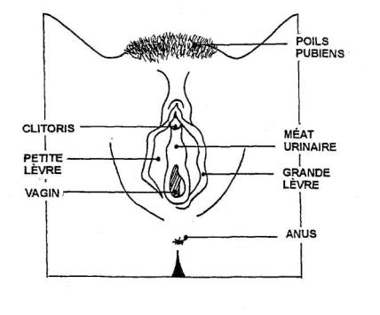
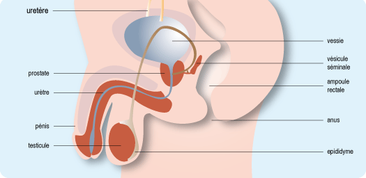

<!-- paginate: true -->

# Leçon 7 : Comment on fait les bébés ? 

---
## Diagnostique

Faire un schéma d'un sexe féminin et d'un sexe masculin en vue extérieure. 

---

---

  
---

 
---

## Activité

Page 172 à 175

Donnez la définition de **reproduction sexuée** et **reproduction asexuée**. 

Evaluation à l'oral au hasard. 

---
## Reproduction sexuée
Cette reproduction correspond à la **rencontre d'individus** de types sexuels différents (mâle et femelle).

Elle n'implique **pas forcément d'accouplement** ou de copulation, car des organismes immobiles comme les plantes, les champignons, les moules, sont aussi capables de reproduction.

La reproduction **n'est possible qu’entre deux individus de la même espèce, et de sexe différent.** 

---
## Reproduction assexuée

Chez les espèces unicellulaires, la **division cellulaire** assure ce type de reproduction de cellules. Toutes les cellules filles issues d'une même cellule mère **sont identiques au parent** dont elles sont issues.

Pour les organismes pluricellulaires : l'organisme mère **se sépare d'une ou plusieurs** cellules (ou une partie de l’organisme), qui seront alors chargées de reconstruire un nouvel organisme identique à l’organisme mère (**un clone**).

---
## Rencontre des gamètes et fécondation

Un **gamète** est une **cellule produite par l’organisme vivant ayant pour unique but la reproduction**, un gamète est une cellule qui contient la **moitié du patrimoine génétique** de l’individu.

---

Chez la femme, c’est **l’ovule**, chez l’homme, le **spermatozoïde**. 

*La **fécondation** correspond à la **rencontre** des gamètes.*

La fécondation peut se faire de façon **interne** (dans le corps de la femelle) ou **externe**. 

---

A l’aide des documents pages 170 à 173, **présentez dans un tableau les différences** entre les fécondations interne et externe.

---

|  Fécondation Externe  | Fécondation Interne   |
|----|----|
|  C’est une fécondation qui se déroule en **dehors** du corps de la femelle.   |  C’est une fécondation qui se déroule **dans** le corps de la femelle.  |
|  Les embryons sont **beaucoup plus exposés** aux risques extérieurs (se faire manger, écraser, froid, chaud). |  Les embryons **ne sont pas exposés** aux risques extérieurs (se faire manger, écraser, froid, chaud). |

---

|  Fécondation Externe  | Fécondation Interne   |
|----|----|
|  Leur taux de survie est très faible. Les oeufs sont fragiles.  |  Leur taux de survie est très haut .  |
|   En échange, les œufs sont pondus en très grande quantité. | En échange, le développement de l’embryon demande du temps, et de l’ énergie à la femelle.  |

---

|  Fécondation Externe  | Fécondation Interne   |
|----|----|
|  Il n’y a pas de soin à l’enfant, les petits sont directement **autonomes**. |  Il y a un **soin obligatoire** au nouveau né, qui n’est pas autonome (allaitement, surveillance, éducation…) |

