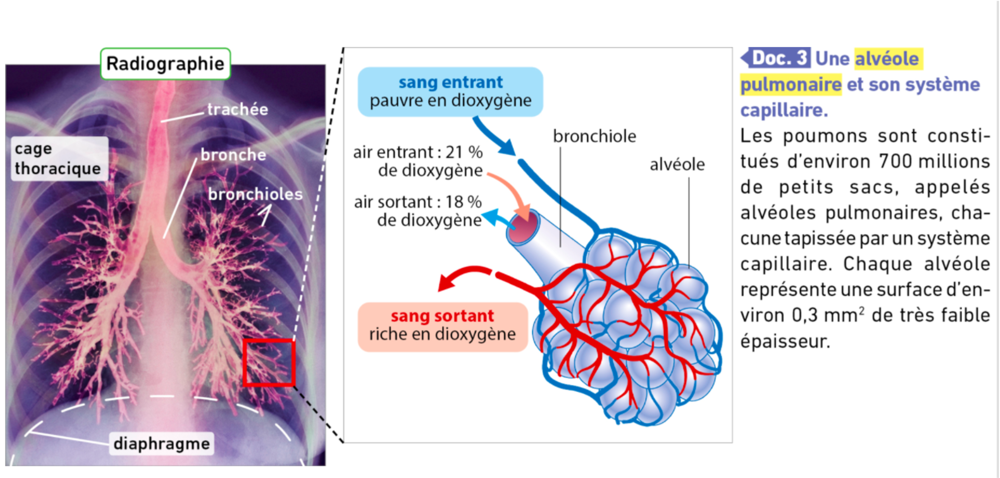
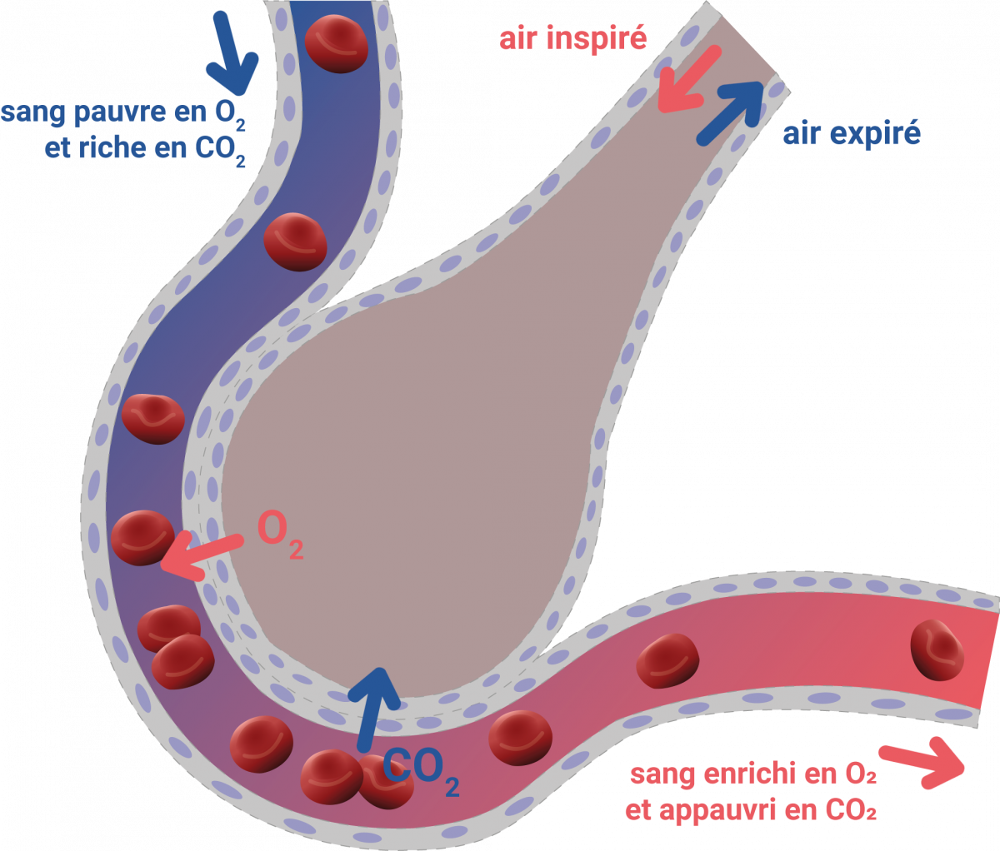
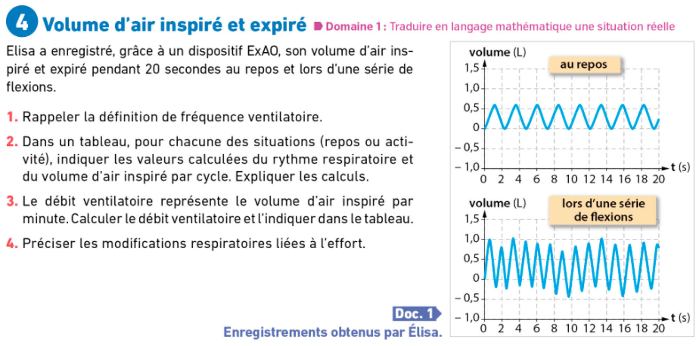
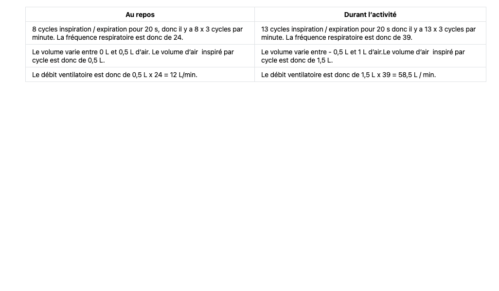

<!-- paginate: true -->

# Leçon 12 : Les échanges gazeux
    
---

---

 
 
---

---
 
 Le poumon a une **structure alvéolaire**, ou spongieuse. 
 
 Cette structure a pour but de **démultiplier** la surface d’échange. 
 Au niveau des alvéoles pulmonaires du dioxygène passe de l’air dans le sang. 

---

# Schéma d'une alvéole pulmonaire

---

---

---
## Correction

1) La fréquence ventilatoire correspond au nombre de cycle d’inspiration / expiration par minute. 

---

---

4) Durant un effort, le **rythme respiratoire** (ou **fréquence ventilatoire**) va augmenter. En même temps, les poumons vont se remplir de davantage d’air par cycle d’inspiration. Il y a donc un double effet durant un effort physique, une augmentation du rythme ventilatoire ainsi qu’une augmentation du volume ventilatoire, ce qui conduit à une augmentation du débit ventilatoire.  

---

<iframe width="1100" height="800" src="https://www.youtube.com/embed/HoZss4Sc1E0" title="YouTube video player" frameborder="0" allow="accelerometer; autoplay; clipboard-write; encrypted-media; gyroscope; picture-in-picture" allowfullscreen></iframe>
