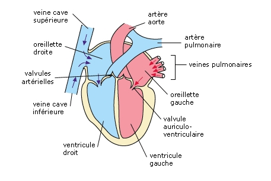
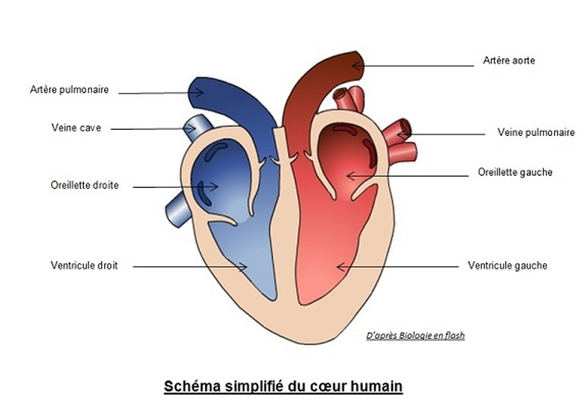

<!-- paginate: true -->

# Leçon 13 : Le coeur

--- 

<iframe width="1100" height="800" src="https://www.youtube.com/embed/u7qZAs5lhBs" title="YouTube video player" frameborder="0" allow="accelerometer; autoplay; clipboard-write; encrypted-media; gyroscope; picture-in-picture" allowfullscreen></iframe>

--- 

## Dissection virtuelle

---

[Lien pour dissection](https://svt.ac-versailles.fr/IMG/archives/docpeda/actpeda/lycee/coeur/page1.html)

---

---

---

