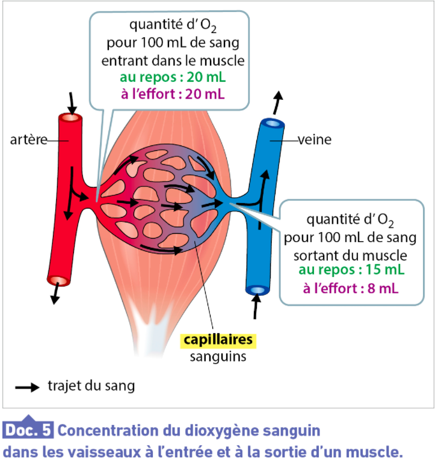
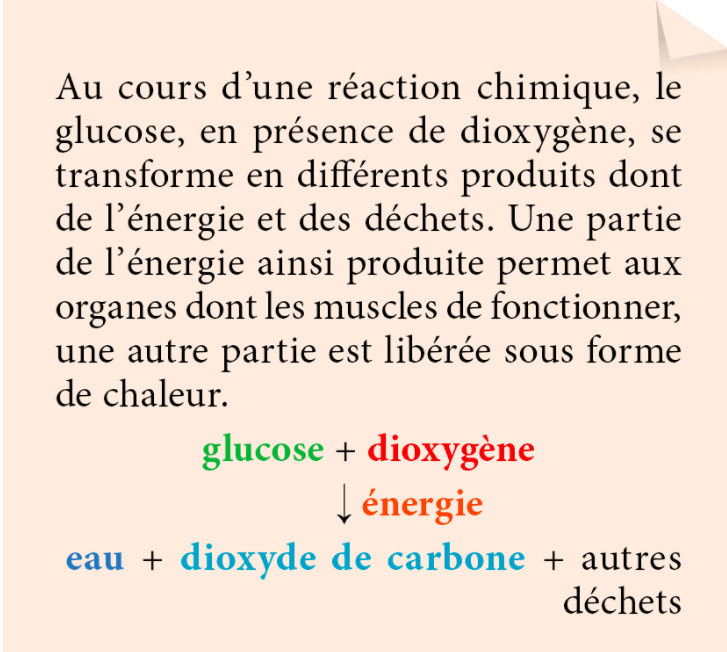

<!-- paginate: true -->

# Leçon 14 : Les organes consomment de l’oxygène et du sucre

---

---

Les organes effectuent en permanence des échanges avec le sang : ils y prélèvent des nutriments et du dioxygène ; ils y rejettent des déchets dont le dioxyde de carbone.

---

---

La consommation de nutriments et de dioxygène, le rejet de dioxyde de carbone par les organes varient selon leur activité, cela s’accompagne de modifications au niveau de l’organisme (augmentation de la température, des rythmes cardiaque et respiratoire). 
