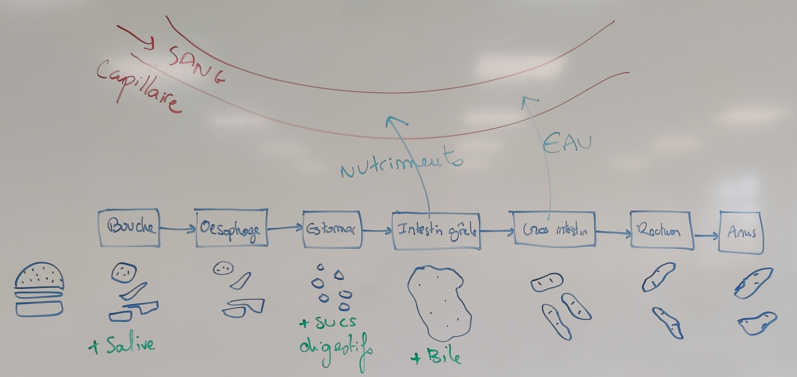

<!-- paginate: true -->

# Leçon 15 : Anatomie de l’appareil digestif. 

---

## Activité : A l'aide des documents pages 18 et 19, décrivez le trajet des aliments dans le tube digestif

--- 

---

---

---

