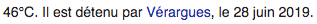
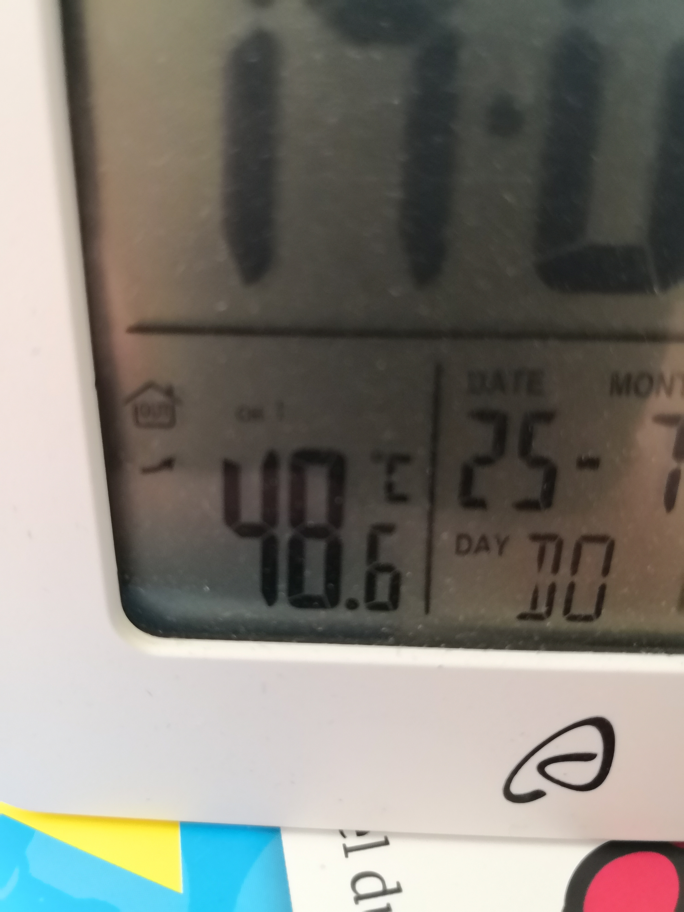
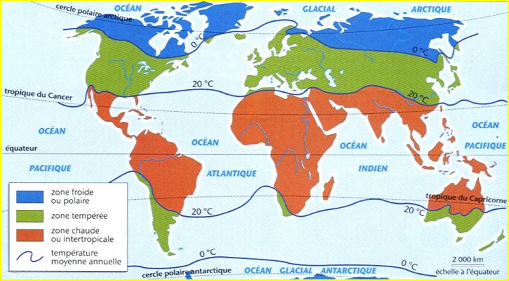

<!-- paginate: true -->

# Leçon 2 : Les climats de la Terre

---

La Terre n’a pas un climat unique, même si l’on peut faire une moyenne des températures sur la planète entière, celle ci n’est pas très représentative. 

La température moyenne de la Terre est de **15°C**.  

---

---

---

---

---
<u>Thermocline : </u> courbe sur une carte représentant une moyenne de température annuelle donnée. 

---

[Retour à la liste des leçons](liste.html)