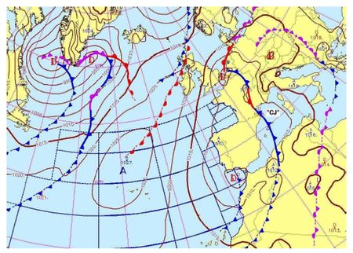
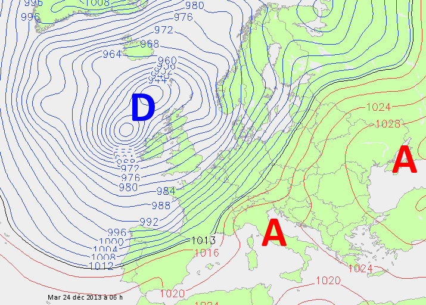
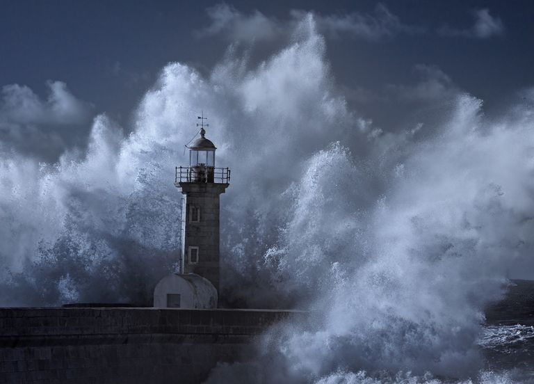

<!-- paginate: true -->

# Leçon 5 : Quand la météo fait n’importe quoi

---

## Apprenons à lire une carte météorologique

---

---

---

---

---

---

---

---

---

---

---

---

---

---

---

# Risques météorologiques et climatiques

---

Un risque est caractérisé par la prise en compte simultanée de 2 facteurs : 

### L'aléa

C'est le phénomène en lui même comme une pluie, du vent, une chute des température... 

### La vulnérabilité 

Il s'agit des infrastructures, ce qui peut être détruit, le danger pour la population. 

---

### Le risque

RISQUE = ALEA x VULNERABILITE 

Un aléa faible avec une forte vulnérabilité entraine un risque faible. Un aléa très fort (tornade ou tsunami) dans une région sans habitant (donc sans vulnérabilité) entraine aussi un risque faible. 

--- 

Le risque climatique est un risque lié aux indices climatiques tels que la **température**, le **vent**, la **neige** ou les **précipitations**. 
On 	distingue ainsi différents risques climatiques, tous couverts par la vigilance météorologique de **Météo France**. Pour l’ensemble 	de ces risques, les consignes à suivre sont édictées par Météo France.

---

## Vent violent & Tempête

---

Un vent est généralement estimé violent donc dangereux lorsque sa vitesse atteint **80 km/h**, et 100 km/h en rafale à l’intérieur des terres.

---

Les principaux dégâts engendrés par les vents violents sont des toitures et cheminées endommagées, des arbres arrachés, des véhicules déportés sur les routes et des coupures d’électricité et de téléphone. 

La circulation routière peut également être perturbée, en particulier sur le réseau secondaire en zone forestière.

---

---

## Neige & Verglas 

---
Les régions sont diversement acclimatées à la neige. Les villes, surtout celles situées en plaine, ne sont en général pas conçues pour vivre avec de la neige et en subiront plus lourdement les effets, même pour un enneigement faible.

---

La formation de verglas ou de plaques de glace rend le réseau routier impraticable et augmente le risque d’accidents.

---

## Grand froid

---

C’est un épisode de temps froid caractérisé par sa **persistance**, son **intensité** et son étendue géographique. L’épisode dure au moins deux jours, pour des températures nettement inférieures aux normales saisonnières de la région concernée. Par ailleurs, la surconsommation électrique due au froid peut engendrer des coupures du réseau d’électricité.

---

## Canicule

---

Le mot **« canicule »** désigne un épisode de températures élevées, de jour comme de nuit, sur une période prolongée (pour le sud de la France, plus de 20 °C la nuit et 35 °C le jour). 
Une forte chaleur devient dangereuse pour la santé dès qu’elle dure plus de trois jours. 

---

Les personnes déjà fragilisées (personnes âgées, personnes atteintes d’une maladie chronique, nourrissons, etc.) sont particulièrement vulnérables. Lors d’une canicule, elles risquent une déshydratation, l’aggravation de leur maladie chronique ou encore un coup de chaleur.

Les personnes en bonne santé (notamment les sportifs et travailleurs manuels exposés à la chaleur) ne sont cependant pas à l’abri si elles ne respectent pas quelques précautions élémentaires.

---

## Vague & Submersion marine

---

Les submersions marines peuvent provoquer des inondations sévères et rapides du littoral, des ports et des embouchures de fleuves. Elles sont liées à une élévation extrême du niveau de la mer due à la combinaison de plusieurs phénomènes comme : 

* l’intensité de la marée 
* le passage d’une tempête

La simultanéité des phénomènes aggrave la submersion, accroît les débordements et permet à la mer d’atteindre des zones habituellement abritées.

---

## Vidéos

--- 

<iframe width="1100" height="800" src="https://www.youtube.com/embed/jgWbYDUm-ME" frameborder="0" allow="accelerometer; autoplay; clipboard-write; encrypted-media; gyroscope; picture-in-picture" allowfullscreen></iframe>

---

<iframe width="1100" height="800" src="https://www.youtube.com/embed/2Rfuoylv34k" frameborder="0" allow="accelerometer; autoplay; clipboard-write; encrypted-media; gyroscope; picture-in-picture" allowfullscreen></iframe>

---

[Retour à la liste des leçons](liste.html)