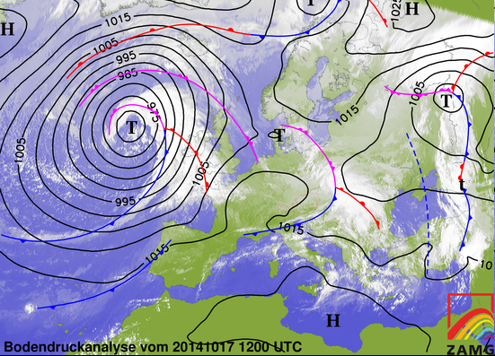
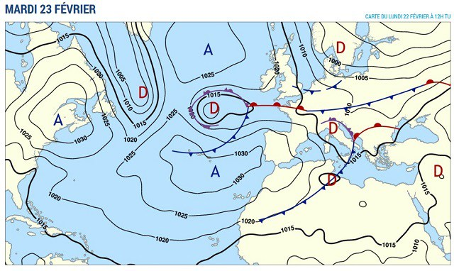
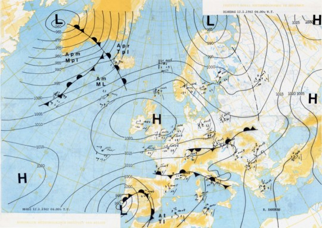

<!-- paginate: true -->

# Leçon 5 : Quand la météo fait n’importe quoi

---

## Apprenons à lire une carte météorologique

---

---

---

---

---

---

---

---

---

---

---

---

---

---

---

[Retour à la liste des leçons](liste.html)