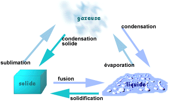

<!-- paginate: true -->

# Leçon 6 : La Terre, notre planète. 

--- 

* Planète tellurique
* Présence d’eau sous ses 3 formes

---

---
* 6 371 km de rayon
* 40 000 km de circonférence à l‘équateur
* Recouverte à 70% d‘eau
* 1 jour = 24 h --> Rotation
* 1 an = 365,25 j --> Révolution

---

[Retour au sommaire](liste.html)

[Leçon précédente](L5.html)

[Leçon suivante](L7.html)