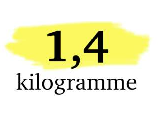
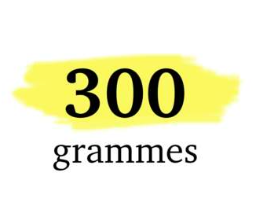

<!-- paginate: true -->

# Leçon 9 : Quelle vision avez-vous du corps humain ? 

--- 

## Combien d'os dans le corps ? 

---

--- 

## Quel quantité de sang dans le corps ? 

---

--- 

## Combien d'eau dans le corps pour un Homme de 70 kg ? 

---

--- 

## Quel poids pour votre cerveau ? 

---

--- 

## Quel poids pour votre coeur ? 

---

