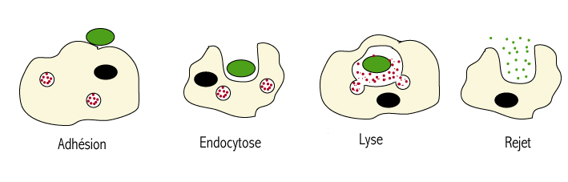

<!-- paginate: true -->
# Cours de 3e

Cours en ligne, version Markdown
COLLET - Pas de reproduction sans mon accord

---

www.profcollet.fr

---

# Leçon 1 : Vous avez peut des petites bêtes ? 

---
 

**Microorganisme :** organisme vivant visible uniquement au microscope, taille inférieure à 100 µm.

**µ :** unité micro, µm = micromètre = 0,000 001 m =  10^-6 m

---
## Activité 1 et 2 p 116

---

  

---
    

---

  

---
   
     

|    |  *Candida albicans* | *Clostridium tetani*   |   *Ebolavirus zaïre* |
|----|----|----|----|
|  **Lieu de vie**  |  Muqueuse  | Sang   |  Cellules  |
|  **Symbtômes**  |  Rougeurs, douleurs  |  Paralysie  |  Fièvre, fatigue  |
|  **Maladie**  |  Mycose  |   Tétanos |  Ebola  |

---

# Leçon 2 : à venir

---
# Leçon 3 : à venir

---
# Leçon 4 : à venir

---
# Leçon 5 : à venir

---
# Leçon 6 : à venir

---

# Leçon 7 : à venir

---
# Leçon 8 : à venir

---

# Leçon 9 : La mitose

---
## Activité pages 204 - 205

---

<iframe height="800px" src="https://www.youtube.com/embed/gYAL1vPOCEQ" frameborder="0" allow="accelerometer; autoplay; clipboard-write; encrypted-media; gyroscope; picture-in-picture" allowfullscreen></iframe>

---

  

  
---

# Leçon 10 : Gènes et allèles

---

Un **gène** est un **morceau d’ADN** qui code pour un **caractère**.     Un **allèle** est une version d’un gène.
   

---

## Rappel sur la reproduction

Deux **cellules reproductrices**, mâles et femelles, les **gamètes**, se rencontrent. Les gamètes mâles, les **spermatozoïdes**, sont petits, mobiles et très nombreux.  Les gamètes femelles, les **ovocytes**, sont le plus souvent gros et immobiles, en petit nombre.    La **cellule-œuf** formée sera à l’origine d'un nouvel individu, ressemblant aux parents mais différent car unique.

---

Un allèle **dominant** est un allèle qui va s’exprimer **prioritairement** sur un allèle **récessif**.   A l’inverse, un allèle **récessif** ne s’exprime qu’en l’absence d’allèle dominant.   Certains allèles sont **co-dominants**. 

---

## Tableau de croisement

---

---

|      | A + | A - | O +  | O -  |
|------|-----|-----|------|------|
| B +  |     |     |      |      |
| B -  |     |     |      |      |
| O +  |     |     |      |      |
| O -  |     |     |      |      |

---

|      | A+| A- | O+  | O-  |
|:------:|:-----:|:-----:|:------:|:------:|
| **B+**  |  `AB++` **[AB+]**  |  `AB+-` **[AB+]**  |   `BO++`  **[B+]** |  `BO+-`  **[B+]**  |
| **B-** |   `AB+-` **[AB+]** |  `AB--`  **[AB-]**|  `OB+-` **[B+]** |  `OB--` **[B-]** |
| **O+**  |   `AO++` **[A+]**|  `AO+-`  **[A+]**|  `OO++`  **[O+]** |   `OO+-` **[O+]**|
| **O-**  |   `AO+-` **[A+]**|  `AO--` **[A-]**|  `OO-+` **[O+]** |   `OO--` **[O-]** |

---

Donc : 
| | |
--- | ---
$[AB+]=\dfrac{3}{16}$ | $[A-]=\dfrac{1}{16}$
$[AB-]=\dfrac{1}{16}$ | $[B-]=\dfrac{1}{16}$
$[A+]=\dfrac{3}{16}$ | $[O+]=\dfrac{3}{16}$
$[B+]=\dfrac{3}{16}$ | $[O-]=\dfrac{1}{16}$

---
# Leçon 11 : Les mutations 

---

# Les mutations

Une mutation est une modification, accidentelle ou provoquée, aléatoire ou souhaitée de l'information génétique (séquence d’ADN) dans le génome.

Une mutation va donc modifier le **génotype**

--- 

## Le code génétique

L'ADN est un langage pour la cellule, cet ADN est composé de 4 nucléotides, servant d'"alphabet" à la cellule pour la traduction de l'ADN. 

Il y a :

* Adénine : **A**

* Thymine : **T**

* Guanine : **G**

* Cytosine : **C** 

---

Exemple d'un extrait de code génétique :

	ATTGCGCTGTGTCAACACGAAACTGACTGACGTTGCCT
	
	||||||||||||||||||||||||||||||||||||||
	
	TAACGCGACACAGTTGTGCTTTGACTGACTGCAACGTA

Les nucléotides s'associe deux par deux : 

* T <=> A
* G <=> C

---

## Mutations somatiques ou germinales

On peut distinguer plusieurs types de mutations.

Une mutation est dite **sexuelle** lorsqu'elle concerne un chromosome sexuel, par exemple X/Y chez les mammifères.

Une mutation est dite **autosomique** lorsqu'elle touche un autre chromosome que les chromosomes sexuels.

--- 

On parle de mutation **germinale** quand la mutation porte sur l'ADN des cellules souches d'un gamète. Dans ce cas, l'embryon sera porteur de la mutation alors qu'aucun de ses parents ne la possédait dans son patrimoine génétique. Ce type de mutation survient lors de la formation ou de la vie des gamètes d'un des deux parents (ovule ou spermatozoïde). 

---

Les mutations **somatiques** ne touchent pas les cellules destinées à la reproduction, elles ne sont donc jamais héréditaires :

---

Des mutations peuvent apparaître tout au long de la vie sur l'ADN de n'importe quelle cellule ; elles sont alors transmises à la lignée des cellules filles. Ces dernières peuvent, dans certains cas, devenir des cellules tumorales puis former un cancer.

---

## Les différents type de mutations

---

### Mutation par substitution

Cette mutation ponctuelle se traduit par le remplacement d'un nucléotide par un autre.

---

	ATTGCGCTGTGTCAACACGAAACTGACTGACGTTGC[C]T
	
	||||||||||||||||||||||||||||||||||||||
	
	TAACGCGACACAGTTGTGCTTTGACTGACTGCAACGTA

devient 

    
	ATTGCGCTGTGTCAACACGAAACTGACTGACGTTGCCT
	
	||||||||||||||||||||||||||||||||||||||
	
	TAACGCGACACAGTTGTGCTTTGACTGACTGCAACGGA

---

### Mutation par délétion

Cette mutation se traduit par la suppression d'un ou plusieurs nucléotides. 

---

	ATTGCGCTGTGTCAACACGAAACTGACTG[ACGTTG]CCT
	
	||||||||||||||||||||||||||||||||||||||
	
	TAACGCGACACAGTTGTGCTTTGACTGACTGCAACGGA

devient 
    
	ATTGCGCTGTGTCAACACGAAACTGACTGCCT
	
	||||||||||||||||||||||||||||||||
	
	TAACGCGACACAGTTGTGCTTTGACTGACGGA

---

### Mutation par insersion

Cette mutation se traduit par l'insersion d'un ou plusieurs nucléotides. 

---

	ATTGCGCTGTGTCAACACGAAACTGACTG[ACGTTG]CCT
	
	||||||||||||||||||||||||||||||||
	
	TAACGCGACACAGTTGTGCTTTGACTGACGGA

devient

	ATTGCGCTGTGTCAACACGAAACTGACTGACGTTGCCT
	
	||||||||||||||||||||||||||||||||||||||
	
	TAACGCGACACAGTTGTGCTTTGACTGACTGCAACGGA

---
  

### Mutation par translocation

Mutation ou une partie d'un gène est déplacé à une autre endroit du génome. 

	ATTGCGCTGTGTCAACACGAAACTGACTGAC[GTTGCC]T
	
	|||||||||||||||||||||||||||||||[||||||]|
	
	TAACGCGACACAGTTGTGCTTTGACTGACTG[CAACGG]A

La partie entre crochet va être déplacé, et va être insérer ailleurs dans le génome, elle sera échangé avec une autre séquence. 

---

### Mutations chromosomiques

Il s'agit de mutations qui touchent le chromosomes en entier. La mutations peut ajouter ou retirer tout ou une partie d'une chromatide. 

Il peut s'agir aussi d'une perte ou d'un gain de chromosomes: trisomie, monosomie.

---

## Conséquences d'une mutation

---

### Mutations faux sens

Modification du génome, qui entraine l'expression d'un caractère dans une version modifiée, qui fonctionne mal. 

> Exemple de la mucuviscidose

---

#### Mutations non-sens

Le changement d'un nucléotide provoque la production d'un caractère non fonctionnel. 

> Exemple des personnes albinos

---

### Mutations silencieuses

Ce sont des mutations qui modifient la séquence de l'ADN, mais ne modifient pas le phénotype.

---

## Mutation provoquée et souhaitée

Un OGM est un **O**rganisme **G**énétiquement **M**odifié, c'est à dire que l'Homme a provoqué une mutation permettant une modification du génotype, et donc du phénotype. 

Un grand nombre d'OGM sont créés uniquement dans le but de mener des expériences scientifiques. Pour comprendre le fonctionnement d'un organisme, la modification de son génome est aujourd'hui l'un des outils les plus utilisés.

---

De nombreux micro-organismes (bactéries, levures, microchampignons) sont relativement faciles à modifier et à cultiver, et sont un moyen relativement économique pour produire des protéines particulières à visée médicale : insuline, hormone de croissance, etc. 

---

Les plantes cultivées principales (soja, maïs, cotonnier, colza, betterave, courge, papaye, tabac, etc.) ont des versions génétiquement modifiées, avec de nouvelles propriétés agricoles : résistance aux insectes, tolérance à un herbicide, enrichissement en composants nutritifs.

---

# Leçon 12 : Méïose

---

<iframe width="1100" height="800" src="https://www.youtube.com/embed/TJtUUTpWWoU" frameborder="0" allow="accelerometer; autoplay; clipboard-write; encrypted-media; gyroscope; picture-in-picture" allowfullscreen></iframe>

---

# Leçon 13 : Histoire de la Terre et Evolution

---

L'histoire de la Terre couvre approximativement 4,5 milliards d'années (4 567 000 000 années), depuis la formation de la Terre à partir de la nébuleuse solaire jusqu'à maintenant.

Les origines de la vie, qui remonteraient à environ 3,5 à 3,8 milliards d'années, demeurent incertaines.

---

L'échelle des temps géologiques est un système de classement chronologique utilisé, notamment en géologie, pour dater les événements survenus durant l'histoire de la Terre.

Chaque jour, les techniques changent ou deviennent plus précises, les échelles doivent ainsi être périodiquement mises à jour, les âges devenant plus précis.

---

<embed src="Fiches/FriseSVT.pdf" width=1200 height=800 type='application/pdf'/>

---
# Ère Primaire

Le Paléozoïque est une ère géologique qui s'étend de -540 à -250 millions d'années. Cette ère est parfois appelée ère Primaire.

Son début correspond classiquement à l'apparition de nombreux fossiles à coquilles dures. Cette ère s'achève par une extinction massive.

---

Cette ère est composée du : **Cambrien, Ordovicien, Silurien, Dévonien, Carbonifère, Permien**

Cette ère est aussi appelée l'ère des poissons, car les espèces dominantes sur Terre sont des poissons et coquillages.
Le fossile caractéristique est le trilobite.

---

---
## Ère Secondaire 

Le Mésozoïque appelé anciennement Ère secondaire, est une ère géologique qui s'étend de − 250 à − 65 Ma, au cours de laquelle apparaissent des espèces de mammifères et de dinosaures.

Sa limite correspond à l'extinction du Crétacé.

L'ère secondaire comprend les trois périodes suivantes:
**Trias, Jurassique, Crétacé**

---

---

L'ère tertiaire est la troisième ère géologique et la plus récente sur l'échelle des temps géologiques, de -65 Ma à nos jours.
L'ère tertiaire se divise en trois périodes géologiques : **Paléogène, Néogène, Quaternaire**

---

# Leçon 14 : L'organisme face au milieu extérieur

---

Comment l'organisme se protège-il des menaces des microorganismes extérieur ? 

---

## Les principaux types de microorganismes

---

  
---

---

---

## Rappels

**Eucaryote :** Cellule possédant un noyau

**Procaryote :** Cellule ne possédant pas de noyau 

---

Une muqueuse est une surface interne humide de notre corps en contact avec l’extérieur.

La plupart des micro-organismes ne nous font rien, d’autres nous sont utiles comme les bactéries dans le tube digestif mais d’autres encore provoquent des maladies : 

On parle de **Pathogène.** 

Rappel : Une bactérie est un être vivant unicellulaire. Un virus est un parasite obligatoire de cellule sans noyau, ni capacité à se reproduire seul.

---

## Définitions

---

<u>Asepsie :</u> Méthode de prévention, éliminant les microorganismes, pathogène ou non. 
<u>Antisepsie :</u> Méthode de désinfection d’une plaie, éliminant les microorganismes juste après la contamination, afin d’éviter l’infection. 
<u>Contamination :</u> On parle de contamination lorsqu’un microorganismes traverse les barrières du corps. 
<u>Contamination directe :</u> contamination entre deux individus
<u>Contamination indirecte :</u> contamination entre deux individus à l’aide d’un intermédiaire. 

---

<u>Infection :</u> Multiplication importante des microorganismes après la contamination, caractérisé par une inflammation. 
<u>Inflammation :</u> Caractérisée par les symptômes suivants : Rougeur, Douleur, Chaleur
<u>Préservatif :</u> dispositif en latex, permettant une asepsie lors des rapports sexuels, est également un moyen de contraception. 
<u>Antibiotiques :</u> substance chimique uniquement efficace sur les bactéries. 
<u>Pathogène :</u> se dit d’un microorganisme qui provoque une maladie. 

---

<iframe width="1100" height="800" src="https://www.youtube.com/embed/YxQyaDML-zg" frameborder="0" allow="accelerometer; autoplay; clipboard-write; encrypted-media; gyroscope; picture-in-picture" allowfullscreen></iframe>

---

# Lecon 15 : Phagocytose

--- 

---

# Leçon 16 : Classification des plantes

--- 

Les plantes sont apparus sur Terre il y a environ 1,2 milliard d'année. Les premières plantes terrestres datent quant à elle d'environ 400 millions d'année. 

---

Les plantes se divisent en plusieurs "familles" : 

* les algues **rouges et vertes**
* les mousses ou **bryophytes**
* les fougères ou **ptéridophytes**
* les conifères/résineux ou **gymnospermes**
* les plantes à fleurs ou **angiosperme**

Dans ce cours, nous ne intéresserons qu'au **angiospermes**. 

---

## Anatomie de la plante à fleur

---

---

La plantes possèdent deux zones de croissances : 

* Un **APEX** racinaire, qui assure une croissance verticale vers le bas. Il est situé au bout de la racine principale. 
* Un **APEX** caulinaire, qui assure une croissance verticale vers le haut. Il est situé au bout de la tige principale. 

>Dans une seconde partie de son développement, et selon les plantes, une croissance secondaire apparait pour une augmentation de circonférence.*

---

## Anatomie de la feuille

---

---

Il existe des formes très différentes pour les feuilles, chaque feuille est une caractéristique de la plante. (Voir [Article Wikipédia](https://fr.wikipedia.org/wiki/Forme_foliaire))

---

## Anatomie de la racine

---

La racine est le plus souvent un organe souterrain ayant deux ou trois rôles :

* **absorber** l'eau et les sels minéraux indispensables à la plante
* **fixer** celle-ci dans le sol 
* un rôle de **réserve**

Les racines sont souvent le siège de symbioses avec les bactéries du sol.
Certaines racines de plantes sont comestibles ou à usage médicinal, d'autres sont hautement toxiques.

---

---

## Anatomie de la tige

---
La tige est l'axe généralement aérien qui prolonge la racine et porte les bourgeons et les feuilles.
La tige se ramifie généralement en branches et rameaux formant l'**appareil caulinaire**. 

La tige diffère de la racine par la présence de nœuds où s'insèrent les bourgeons et les feuilles. 
La transition entre racine et tige se fait dans le « collet ». 

Il peut exister des tiges souterraines comme il existe des racines aériennes.

---

## Anatomie de la fleur 

---

Chez les plantes à fleurs (angiospermes), la fleur constitue l'organe de la *reproduction sexuée* et l'ensemble des "enveloppes" qui l'entourent. 
Après la pollinisation, la fleur est fécondée et se transforme en **fruit** contenant les **graines**. Les fleurs peuvent être solitaires, mais elles sont le plus souvent regroupées en [inflorescences](https://fr.wikipedia.org/wiki/Inflorescence).

---

---

# Leçon 17 :  La cellule végétale

---

## Caractéristiques distinctives des cellules végétales

Les principaux caractères distinctifs sont les suivants :

* _une vacuole_: (entourée d'une membrane), qui maintient la turgescence(1) de la cellule et contrôle les échanges de molécules entre le cytoplasme et la sève.
Les vacuoles servent aussi de "poubelles" et d'"entrepôt" aux cellules végétales, à la fin de la vie de la cellule, ces vacuoles prennent 90 % de l'espace cellulaire.

---

>Turgescence : La turgescence est l'état d'une cellule vivante dilatée par l'eau qui y est entrée, et qui s'accumule dans ses vacuoles ou ses vésicules.

---

* _une paroi pectocellulosique_ :  faite de cellulose et de protéines, elle se trouve à l'extérieur de la membrane cellulaire. 

* _les plastes_ :, en particulier les **chloroplastes** qui contiennent la **chlorophylle**, ce pigment qui donne aux plantes leur couleur verte et qui intervient dans le processus de la photosynthèse.

---
 
Comme les autres cellules eucaryotes, les cellules végétales possèdent typiquement un **noyau**, qui contient l'essentiel de l'ADN cellulaire, et des **mitochondries**, lieu de la respiration cellulaire. 

---

## Schéma de la cellule végétale

---

--- 

# Leçon 18 : La Photosynthèse

---

La photosynthèse est le processus, se déroulant dans les chroloplastes (voir *cellule végétale*), qui permet à des organismes  de synthétiser de la matière organique en utilisant l'énergie lumineuse. Elle apparaît il y a plus de **2,45 milliards d'années.**

Elle désigne en particulier la **photosynthèse oxygénique**, qui a produit un bouleversement écologique majeur en faisant évoluer l'atmosphère alors riche en méthane, en l'actuelle, composée essentiellement d'azote (78,08 %) et de dioxygène (20,95%).

---

C'est la photosynthèse oxygénique qui maintient constant le taux d'oxygène dans l'atmosphère terrestre et fournit toute la matière organique ainsi que l'essentiel de l'énergie utilisées par la vie sur Terre.

> Aujourd'hui, la puissance moyenne captée par la photosynthèse à l'échelle du globe avoisine 130 térawatts ce qui équivaut à environ six fois la consommation énergétique de l'humanité.

---

