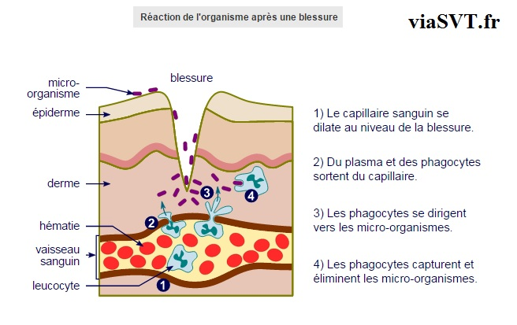
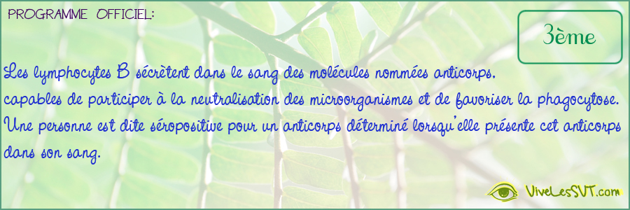
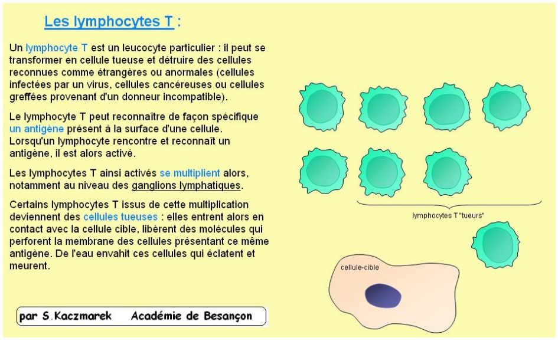

<!-- paginate: true -->

# Leçon 16 : L'immunité humaine

---

## L'immunité innée

---

L’ouverture de la barrière naturelle mécanique (peau) permet à des micro-organismes de pénétrer si la plaie n’est pas désinfectée. Des globules blancs = leucocytes interviennent pour défendre l’organisme. Cette première étape est une réaction locale appelée inflammation.

---

---

Certains leucocytes sont doués de PHAGOCYTOSE, on les appelle les PHAGOCYTES. Lors de la phagocytose, le phagocyte adhère à la bactérie ou aux cellules mortes de l’organisme et absorbe le micro-organisme. Celui-ci est ensuite digéré par des ENZYMES dans la cellule. Enfin, les déchets issus de la digestion du micro-organisme seront expulsés.

Les phagocytes peuvent ingérer plusieurs bactéries à la fois. La phagocytose est une réaction immunitaire rapide et non spécifique, elle dure environ 1 heure.

---

## Jouons un peu ! 

[Lien du jeu en ligne](http://philippe.cosentino.free.fr/productions/leucowar/)

---

## L'immunité adaptative

Notion d’anticorps et d’antigène

<u>Anticorps :</u> molécule en forme de Y produite par les lymphocytes qui se fixe sur les antigènes, les neutralise et facilite la phagocytose

<u>Antigène :</u> molécule qui est reconnue comme étrangère par l’organisme et qui déclenche une réaction de défense. Les antigènes sont portés par les microbes.

---

Un anticorps donné est spécifique à un antigène donné. Un individu est dit séropositif quand il sécrète un anticorps spécifique à un antigène. La réaction engendrée par les lymphocytes B s’appelle la réaction immunitaire à médiation humorale. Cette réaction adaptative est lente et spécifique à un antigène donné.

---

---

Les lymphocytes T détruisent directement les cellules étrangères. Les cellules cibles sont des cellules contre lesquelles l’attaque du système immunitaire est dirigée (cellule infectée par un virus, cellule greffée ou cellule cancéreuse).

---

---

