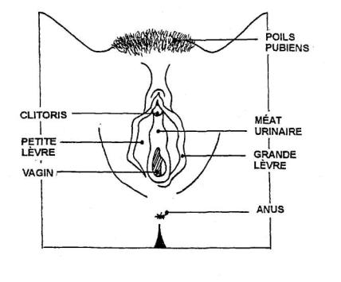
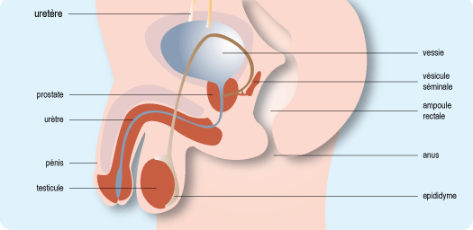
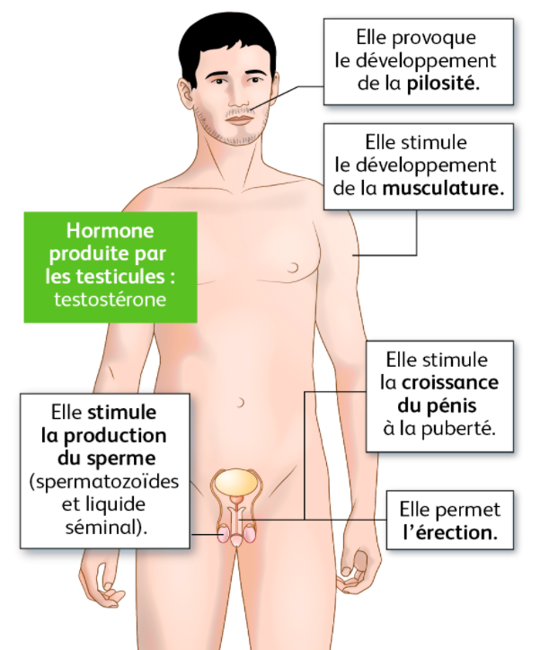
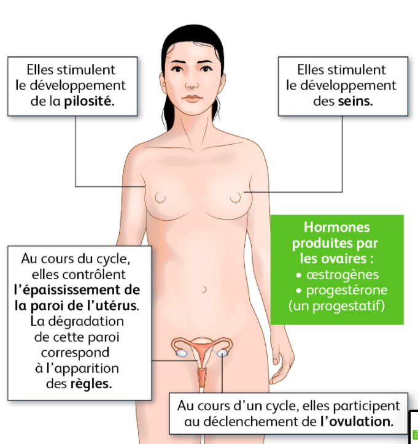
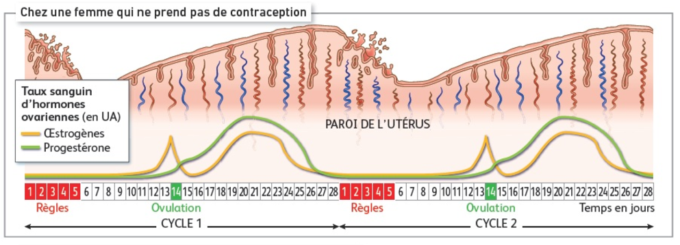

<!-- paginate: true -->
# Cours de 4e

Cours en ligne, version Markdown
COLLET - Pas de reproduction sans mon accord

---

Ce cours est en évolution permanante, selon ce que je trouve, ce que je rajoute, des noueautés Markdown que je découvre... 

---

www.profcollet.fr

---
# Thème : Géologie
---
# Leçon 1 : A venir... 

---
# Leçon 2 : A venir...

---

# Leçon 3 : A venir...

---

# Leçon 4 : A venir...

---

# Leçon 5 : A venir...

---

# Leçon 6 : A venir...

---

# Thème : Reproduction

---

# Leçon 7 : Comment on fait les bébés ? 

---
## Diagnostique

Faire un schéma d'un sexe feminin et d'un sexe masculin en vue extérieure. 

---

---

  
---

 
---

## Activité

Page 172 à 175

Donnez la définition de **reproduction séxuée** et **reproduction asexuée**. 

Evaluation à l'oral au hasard. 

---
## Reproduction sexuée
Cette reproduction correspond à la **rencontre d'individus** de types sexuels différents (mâle et femelle).

Elle n'implique **pas forcément d'accouplement** ou de copulation, car des organismes immobiles comme les plantes, les champignons, les moules, sont aussi capables de reproduction.

La reproduction **n'est possible qu’entre deux individus de la même espèce, et de sexe différent.** 

---
## Reproduction assexuée

Chez les espèces unicellulaires, la **division cellulaire** assure ce type de reproduction de cellules. Toutes les cellules filles issues d'une même cellule mère **sont identiques au parent** dont elles sont issues.

Pour les organismes pluricellulaires : l'organisme mère **se sépare d'une ou plusieurs** cellules (ou une partie de l’organisme), qui seront alors chargées de reconstruire un nouvel organisme identique à l’organisme mère (**un clone**).

---
## Rencontre des gamètes et fécondation

Un **gamète** est une **cellule produite par l’organisme vivant ayant pour unique but la reproduction**, un gamète est une cellule qui contient la **moitié du patrimoine génétique** de l’individu.

---

Chez la femme, c’est **l’ovule**, chez l’homme, le **spermatozoïde**. 

*La **fécondation** correspond à la **rencontre** des gamètes.*

La fécondation peut se faire de façon **interne** (dans le corps de la femelle) ou **externe**. 

---

A l’aide des documents pages 170 à 173, **présentez dans un tableau les différences** entre les fécondations interne et externe.

---

|  Fécondation Externe  | Fécondation Interne   |
|----|----|
|  C’est une fécondation qui se déroule en **dehors** du corps de la femelle.   |  C’est une fécondation qui se déroule **dans** le corps de la femelle.  |
|  Les embryons sont **beaucoup plus exposés** aux risques extérieurs (se faire manger, écraser, froid, chaud). |  Les embryons **ne sont pas exposés** aux risques extérieurs (se faire manger, écraser, froid, chaud). |

---

|  Fécondation Externe  | Fécondation Interne   |
|----|----|
|  Leur taux de survie est très faible. Les oeufs sont fragiles.  |  Leur taux de survie est très haut .  |
|   En échange, les œufs sont pondus en très grande quantité. | En échange, le développement de l’embryon demande du temps, et de l’ énergie à la femelle.  |

---

|  Fécondation Externe  | Fécondation Interne   |
|----|----|
|  Il n’y a pas de soin à l’enfant, les petits sont directement **autonomes**. |  Il y a un **soin obligatoire** au nouveau né, qui n’est pas autonome (allaitement, surveillance, éducation…) |

---

# Leçon 8 : Il ne pourra en rester qu'un !

---

## Exercice page 180

---
## Relation Proie / Prédateur

---

---

---

## Définitions 

**Proie** : Animal chassé par un prédateur. 

**Prédateur** : Espèce qui va se nourrir d'un autre animal (Proie)

---

## Relation entre le Lynx et le lièvre

> On sait que le lynx se nourrit à 95% de lièvres.

On observe que de manière recurrente, les populations de lynx et de lièvres augmentent puis diminuent. Quand la population de lièvres augmente, **alors** la population de lynx augmente aussi.

Une fois que la population de lynx est haute, on observe que la population de lièvre **diminue**. Ce qui entraine par la suite une **diminution** de la population de lynx. 

Puis le cycle recommence. 

---

---

# Leçon 9 : La puberté

---

## Définition

---

La puberté correspond au passage de **l'enfance à l'adulte**. 

Ce passage comprend de nombreuses transformations physiques, et psychologique. 

La puberté est **une obligation métabolique**. 

La fin de la puberté correspond aussi à la **capacité de se reproduire**.

---

Donnez la liste des modifications qui se produisent chez **l'homme** et chez la **femme** lors de la puberté. 

---

## Transformations chez la femme

- Apparition des règles et du cycle menstruel
- Développement de la pilosité
- Croissance- Développement de poitrine
- Acné et boutons (changement de l'équilibre de la peau)
- Modification de la voix (mue)

---

- Modification de l'équilibre chimique du cerveau ==> **modification du comportement**
- Modification des os du bassin (hanches qui s'élargissent)
- Hormones qui changent (Oeustrogène et Progestérone)

---
## Transformations chez l'homme

- Développement de la pilosité
- Modification de la voix (mue)
- Hormone qui change (Testostérone)
- Acné et boutons (changement de l'équilibre de la peau)
- Croissance

---

- Développement de la taille du pénis
- Prise de masse musculaire
- Descente des testicules
- Modification de l'équilibre chimique du cerveau ==> **modification du comportement**

---

# Leçon 10 : Organes reproducteurs féminins

---

---

# Leçon 11 : Organes reproducteurs masculins

---

---

# Leçon 12 : Les hormones c'est quoi ? 

---

---
## Chez l'homme

---

La **Testostéronne** est produite par les tersticules, elle vont provoqués plusieurs phénomènes : 
- (+) la production de sperme
- Elle permet l'érection
- Elle stimule le developpement musculaire
- Elle developpe la pilosité

---

## Chez la femme

---
Les femmes produisent 2 types d'hormones : 
- l'oeustrogène
- la progestéronne

Elles stimulent le developpement de la pilosité. 
Elles stimulent le developpement de la poitrine et l'elargissement des hanches. 

Elles participent au cycle de l'utérus en controllant l'épaississement de la muqueuse utérinne. 

---

--- 

