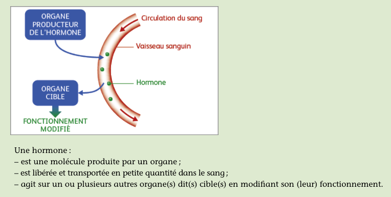

<!-- paginate: true -->
# Cours de 4e

Cours en ligne, version Markdown
COLLET - Pas de reproduction sans mon accord

---

Ce cours est en évolution permanante, selon ce que je trouve, ce que je rajoute, des noueautés Markdown que je découvre... 

---

www.profcollet.fr

---
# Thème : Géologie
---
# Leçon 1 : A venir... 

---
# Leçon 2 : A venir...

---

# Leçon 3 : A venir...

---

# Leçon 4 : A venir...

---

# Leçon 5 : A venir...

---

# Leçon 6 : A venir...

---

# Thème : Reproduction

---

# Leçon 7 : Comment on fait les bébés ? 

---
## Diagnostique

Faire un schéma d'un sexe feminin et d'un sexe masculin en vue extérieure. 

---

---

  
---

 
---

## Activité

Page 172 à 175

Donnez la définition de **reproduction séxuée** et **reproduction asexuée**. 

Evaluation à l'oral au hasard. 

---
## Reproduction sexuée
Cette reproduction correspond à la **rencontre d'individus** de types sexuels différents (mâle et femelle).

Elle n'implique **pas forcément d'accouplement** ou de copulation, car des organismes immobiles comme les plantes, les champignons, les moules, sont aussi capables de reproduction.

La reproduction **n'est possible qu’entre deux individus de la même espèce, et de sexe différent.** 

---
## Reproduction assexuée

Chez les espèces unicellulaires, la **division cellulaire** assure ce type de reproduction de cellules. Toutes les cellules filles issues d'une même cellule mère **sont identiques au parent** dont elles sont issues.

Pour les organismes pluricellulaires : l'organisme mère **se sépare d'une ou plusieurs** cellules (ou une partie de l’organisme), qui seront alors chargées de reconstruire un nouvel organisme identique à l’organisme mère (**un clone**).

---
## Rencontre des gamètes et fécondation

Un **gamète** est une **cellule produite par l’organisme vivant ayant pour unique but la reproduction**, un gamète est une cellule qui contient la **moitié du patrimoine génétique** de l’individu.

---

Chez la femme, c’est **l’ovule**, chez l’homme, le **spermatozoïde**. 

*La **fécondation** correspond à la **rencontre** des gamètes.*

La fécondation peut se faire de façon **interne** (dans le corps de la femelle) ou **externe**. 

---

A l’aide des documents pages 170 à 173, **présentez dans un tableau les différences** entre les fécondations interne et externe.

---

|  Fécondation Externe  | Fécondation Interne   |
|----|----|
|  C’est une fécondation qui se déroule en **dehors** du corps de la femelle.   |  C’est une fécondation qui se déroule **dans** le corps de la femelle.  |
|  Les embryons sont **beaucoup plus exposés** aux risques extérieurs (se faire manger, écraser, froid, chaud). |  Les embryons **ne sont pas exposés** aux risques extérieurs (se faire manger, écraser, froid, chaud). |

---

|  Fécondation Externe  | Fécondation Interne   |
|----|----|
|  Leur taux de survie est très faible. Les oeufs sont fragiles.  |  Leur taux de survie est très haut .  |
|   En échange, les œufs sont pondus en très grande quantité. | En échange, le développement de l’embryon demande du temps, et de l’ énergie à la femelle.  |

---

|  Fécondation Externe  | Fécondation Interne   |
|----|----|
|  Il n’y a pas de soin à l’enfant, les petits sont directement **autonomes**. |  Il y a un **soin obligatoire** au nouveau né, qui n’est pas autonome (allaitement, surveillance, éducation…) |

---

# Leçon 8 : Il ne pourra en rester qu'un !

---

## Exercice page 180

---
## Relation Proie / Prédateur

---

---

---

## Définitions 

**Proie** : Animal chassé par un prédateur. 

**Prédateur** : Espèce qui va se nourrir d'un autre animal (Proie)

---

## Relation entre le Lynx et le lièvre

> On sait que le lynx se nourrit à 95% de lièvres.

On observe que de manière recurrente, les populations de lynx et de lièvres augmentent puis diminuent. Quand la population de lièvres augmente, **alors** la population de lynx augmente aussi.

Une fois que la population de lynx est haute, on observe que la population de lièvre **diminue**. Ce qui entraine par la suite une **diminution** de la population de lynx. 

Puis le cycle recommence. 

---

---

# Leçon 9 : La puberté

---

## Définition

---

La puberté correspond au passage de **l'enfance à l'adulte**. 

Ce passage comprend de nombreuses transformations physiques, et psychologique. 

La puberté est **une obligation métabolique**. 

La fin de la puberté correspond aussi à la **capacité de se reproduire**.

---

Donnez la liste des modifications qui se produisent chez **l'homme** et chez la **femme** lors de la puberté. 

---

## Transformations chez la femme

- Apparition des règles et du cycle menstruel
- Développement de la pilosité
- Croissance
- Développement de poitrine
- Acné et boutons (changement de l'équilibre de la peau)
- Modification de la voix (mue)

---

- Modification de l'équilibre chimique du cerveau ==> **modification du comportement**
- Modification des os du bassin (hanches qui s'élargissent)
- Hormones qui changent (Oeustrogène et Progestérone)

---
## Transformations chez l'homme

- Développement de la pilosité
- Modification de la voix (mue)
- Hormone qui change (Testostérone)
- Acné et boutons (changement de l'équilibre de la peau)
- Croissance

---

- Développement de la taille du pénis
- Prise de masse musculaire
- Descente des testicules
- Modification de l'équilibre chimique du cerveau ==> **modification du comportement**

---

# Leçon 10 : Organes reproducteurs féminins

---

---

# Leçon 11 : Organes reproducteurs masculins

---

---

# Leçon 12 : Les hormones c'est quoi ? 

---

Travail de recherche

3 thèmes : 

1. Les effets de la testostérone sur le corps.
2. Les effets des oestrogènes sur le corps.
3. Les effets de la progestérone sur le corps. 

---

1 ou 2 page. 
Avec 1 ou 2 images maxi. 

Attention au copier/coller. 
Avec Libre Office Writer (Traitement de texte)

---

Pour me rendre votre travail : 

1. Aller sur www.profcollet.fr
2. Cliquez sur le lien "SVT - Hormones 4e"
3. Suivre les instructions

---

---
## Chez l'homme

---

La **Testostérone** est produite par les testicules, elle va provoqué plusieurs phénomènes : 
- (+) la production de sperme
- Elle permet l'érection
- Elle stimule le developpement musculaire
- Elle developpe la pilosité

---

* C'est la principale hormone sexuelle mâle.

* Chez l'homme, la testostérone joue un rôle-clé dans la santé et le bien-être, en particulier dans le fonctionnement sexuel.

* Contrairement à une croyance populaire, la testostérone n'est pas associée à une augmentation de l'agressivité.

---

* Cependant, elle est associée à la compétition et aux comportements de dominance chez les animaux. Elle augmente durant l'anticipation d'activités sportives et après la victoire. 

* Elle produit aussi une réduction des réactions de peur et de stress. 

* La testostérone participe à la perte de cheveux de l'homme avec l'âge.

* Le taux de testostérone décroit avec l'âge chez l'homme. 

---

### Exemple de l'effets de la testostérone chez le rat mâle

Chez le rat mâle, le comportement sexuel dépend du niveau de testostérone. La castration réduit l'activité sexuelle. La testostérone augmente celle-ci. 

---

## Chez la femme

---
Les femmes produisent 2 types d'hormones : 
- l'oestrogène
- la progestérone

Elles stimulent le developpement de la pilosité. 
Elles stimulent le developpement de la poitrine et l'elargissement des hanches. 

Elles participent au cycle de l'utérus en controllant l'épaississement de la muqueuse utérinne. 

---

### L'œstrogène

L'œstrogène est une hormone sexuelle femelle primaire. 

Elle est produite par le développement des follicules des ovaires et par le placenta lors de la grossesse. 

> Il existe 3 sortes d'œstrogènes : l'**œstradiol**, l'**œstriol** et l'**œstrone**. 

---

Les œstrogènes jouent un rôle central dans la reproduction.

Elles favorisent le développement des **caractères sexuels secondaires** féminins, comme les seins, et sont également impliquées dans le contrôle du cycle menstruel, ce qui explique pourquoi la plupart des contraceptifs hormonaux comme les pilules contraceptives en contiennent. 

---
### La progestérone 

La progestérone est une hormone principalement sécrétée par les ovaires et le placenta. 
Elle est impliquée dans la grossesse et l'embryogenèse(formation de l'embryon) de nombreuses espèces de mammifères, ainsi que dans le cycle menstruel.

--- 

## Le cycle menstruel

Avant de concevoir un enfant, la femme doit produire des ovocytes et l'homme des spermatozoïdes. La fabrication de ces cellules s'effectue sous le contrôle des hormones durant le cycle menstruel.

Entre la puberté et la ménopause, la femme peut se reproduire grâce au fonctionnement cyclique de ses ovaires.

Le cycle menstruel dure environ 28 jours et comprend les phases suivantes :

---

* **jours 1 à 5 :** ce sont les règles, au cours desquelles une partie de la muqueuse utérine est éliminée 

* **jours 6 à 13 :** un follicule d'un des deux ovaires achève sa croissance. Les cellules folliculaires fabriquent des oestrogènes et leur taux augmente dans le sang. La muqueuse  de l'utérus se développe

---

* **jour 14 :** c'est l'ovulation, au cours de laquelle le follicule mûr expulse l'ovocyte. L'ovulation est déclenchée par le pic d'une hormone. La glaire cervicale présente au niveau du col de l'utérus est lâche, afin de laisser passer les spermatozoïdes

>ATTENTION : on pense à tort que l'ovulation a lieu au 14e jour, en réalite elle a lieu 14 jours avant le debut des règles suivante... ce qui tombe le 14e jour pour un cycle de 28 jours, mais toutes les femmes n'ont pas un un cycle de 28  jours. 
--- 

* **jours 15 à 28 :** le follicule évolue en corps jaune, qui produit des oestrogènes et de la progestérone. La muqueuse utérine prend un aspect de dentelle : elle est prête à accueillir l'embryon. S'il n'y a pas de fécondation, le corps jaune régresse, les taux d'hormones ovariennes chutent, d'où le déclenchement des règles.

---

---

# Leçon 13 : Contraception

--- 

## Faisons la liste des moyens de contraception

--- 

- Préservatif
- Pillules
- Implants
- Diaphragme
- Gel spermicide
- Injections
- Stérilisation

---

## Préservatif masculin

Le préservatif masculin est un étui souple en latex qui recueille le sperme lors de l’éjaculation et empêche les spermatozoïdes de rencontrer l’ovule dans les voies génitales féminines.
>**Il joue aussi un rôle essentiel dans la prévention des maladies sexuellement transmissibles (MST) comme le vih.**

---

---

## Préservatif feminin

Le préservatif féminin est constitué d’un tube en polyuréthane souple, dont une extrémité est fermée et placée sur le col de l’utérus à l’aide d’un anneau souple. L’autre extrémité, ouverte, reste à l’extérieur de la vulve. Un préservatif neuf doit être utilisé à chaque relation.
>**Le préservatif féminin constitue également une protection contre la contamination par les MST.**

---

## Pilules

Les pilules contraceptives sont prescrites à la femme, après examen médical, pour bloquer l’ovulation. Ces pilules, à base d’œstrogène et de progestérone, hormones produites par l’ovaire, modifient le cycle ovarien. Elles bloquent l’ovulation et agissent sur l’endomètre qui ne peut plus accueillir l’embryon. La prise de pilules empêche la fécondation et la nidation.
Ces pilules, sous formes de mini-doses essentiellement, sont optimisées pour un meilleur respect de la physiologie féminine et pour une meilleure contraception.

---

## Implants

Il représente un nouveau dispositif contraceptif. Il consiste à placer sous la peau un bâtonnet hormonal dans la face interne du bras. Ce bâtonnet délivre de façon continue de la progestérone qui bloque l’ovulation.

---

## Diaphragme

Le diaphragme est constitué d'une membrane en caoutchouc souple, tendue sur un cercle métalique rigide. Il bloque la progression des spermatozoïdes dans les voies génitales féminines. Pour améliorer son efficacité, qui est limitée, le diaphragme est souvent enduit d’une crème spermicide.

---

---

## Les stérilets

Le stérilet est un dispositif en plastique souple et en cuivre, de petite taille. Sa mise en place, au niveau de l’utérus, est réalisée par le médecin pour deux ans. Sa présence rend l’endomètre inapte à la nidation d'un embryon. En France, seules les femmes ayant déjà eu des enfants et qui n’en désirent plus utilisent le stérilet, en raison d’un risque possible d’infection ou de grossesse extra-utérine pouvant causer une stérilité.

---

## Les fausses contraceptions

---

## Pilule du lendemain

En dehors de l’utilisation du stérilet, lorsque les rapports sexuels ne sont pas, ou sont mal protégés, il peut y avoir un risque de grossesse non désirée. Dans ce cas, il existe une intervention possible en administrant une dose massive d’hormones. Celles-ci vont agir sur l’appareil reproducteur en retardant l’ovulation, en immobilisant les spermatozoïdes dans les voies génitales ou en modifiant l’endomètre provoquant ainsi l’évacuation d’un éventuel embryon.

---

Mais cette intervention ne peut être efficace que si elle se fait dans les 12 heures qui suivent le rapport non protégé. Elle se fait sous surveillance médicale, car elle est physiologiquement et psychologiquement éprouvante pour la personne qui l’utilise. Cette intervention doit être strictement réservée aux cas d’urgence. Elle ne peut pas remplacer une méthode contraceptive préventive et responsable.

---

## Les croyances populaires

Il existe d'autres méthodes contraceptives, mais celles-ci sont à éviter, car leur efficacité est extrêmement limitée. Il s'agit du retrait, de la méthode de la température, de la toilette vaginale, de la détermination de la période de fécondité par le calcul des jours.

