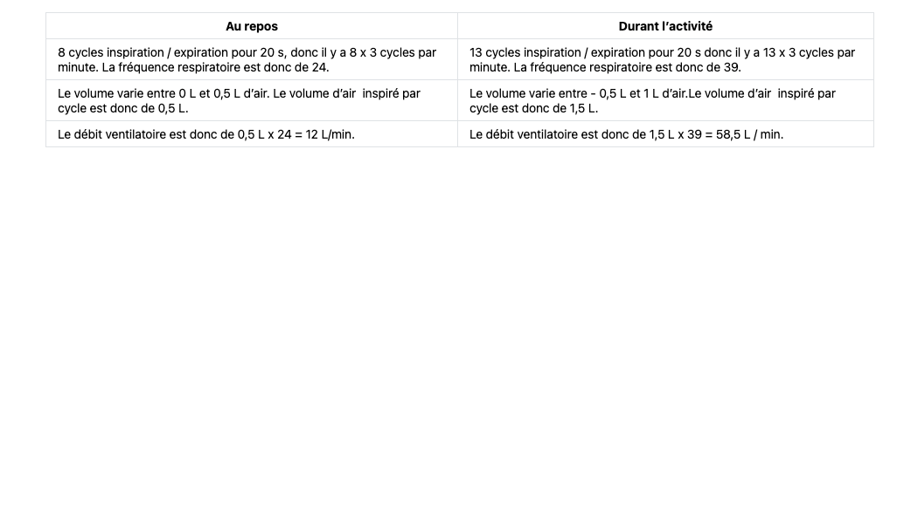

<!-- paginate: true -->
# Cours de 5e

Cours en ligne, version Markdown
COLLET - Pas de reproduction sans mon accord

---

Ce cours est en évolution permanante, selon ce que je trouve, ce que je rajoute, des noueautés Markdown que je découvre... 

---

---

# Thème : Planète Terre

---
# Leçon 1 : La météo, le climat, c’est quoi ?

---

---

La météorologie est une science qui a pour objet l'étude des **phénomènes atmosphériques** tels que les **nuages**, les **précipitations** ou le **vent** dans le but de comprendre comment ils se forment et évoluent en fonction des paramètres mesurés tels que la **pression**, la **température** et **l'humidité**.

---

Pour faire de la météorologie, il nous faut différents appareils de mesures : 

---

### Un thermomètre : 

Il nous donne la température en °C (degrés Celsius). Le thermomètre est un appareil indispensable. Il existe d'autres façon de mesurer la température : 

* Le Kelvin, unité scientifique, 1K correspond à 1°C ; 0K = -273°C.
* Le degrés Fahrenheit, utilisé uniquement aux USA. 

---

---

### Un pluviomètre : 

Il nous donne la quantité d’eau tombé, en mm de précipitation. Cela correspond à 1L d’eau sur une surface de 1 m2

---

---

### Un baromètre : 

Il nous donne la pression atmosphérique en Hpa (hectopascal). 
Sous la barre des 1015 Hpa, ce sont les basses pressions, au dessus de 1015 Hpa, ce sont les hautes pressions. 

---

---

### Un hygromètre : 

Il nous donne la quantité d’eau sous forme de vapeur dans l’air. C'est une quantité relative, un même pourcentage d'humidité ne correspond pas à la même quantité d'eau à des températures différentes. 

---

---

### Un anémomètre : 

Il nous donne la vitesse des vents en km/h ou m/s.

---

---

### Un luxmètre : 

Il nous donne la luminosité en lux (1 lumen /m2). Un lumen correspond à la luminosité d'une bougie. 

---

---

## Définitions

 *Météorologie* : étude des **phénomènes atmosphériques** sur un **court terme**, sur une **zone limitée**. 

---

---

*Climatologie :* Etude des **phénomènes météorologiques** dans différentes parties du globe, sur une **longue durée** et **zone étendue**. La climatologie se sert des moyennes des températures, précipitations... 

---

## Exemples

---

### Pluie de poissons

---

---

### Neige dans le désert

---

 

---

### Pluies

---

---

### Canicule

---

---

### Grêle

---

---

### Tempêtes

---

---

### Tornade

---

---

### Vent

--- 

---

### Neige

---

---

### Crues

---

---

### Orage

---

---

# Leçon 2 : Les climats de la Terre

---

La Terre n’a pas un climat unique, même si l’on peut faire une moyenne des températures sur la planète entière, celle ci n’est pas très représentative. 

La température moyenne de la Terre est de **15°C**.  

---

---

---

---

---
# Leçon 3 : Dynamique des masses d’airs

---
L’Atmosphère est l’enveloppe de gaz qui entoure la Terre, que l’on appelle le plus souvent « AIR ».

L’atmosphère est un mélange de gaz, les plus courant sont : 

- le diazote à 78 %
- le dioxygène à 21 % 
- 1 % de beaucoup d’autres gaz

---

L’atmosphère est également composée de vapeur d’eau. 

---
**L’air chaud est moins dense que l’air froid**, on peut dire qu’il est moins lourd, donc quand il y a de l’air chaud et de l’air froid, l’air **froid va descendre et l’air chaud va monter**. 

---

Comme l’air chaud **monte**, il y a moins d’air au niveau du sol, il y a donc moins de pression, ce qu’on appelle **basse pression**. 
On parle de pression atmosphérique, la pression que fait l’air sur nous.

L’air froid a tendance à **descendre**, il va donc s’accumuler près du sol, formant les **hautes pressions**.

---
## Activité en groupe

Avec l’aide de votre voisin, tentez de représentez ces basses et hautes pressions sous forme d’un schéma. 
Des mouvements de masses d’airs doivent apparaitre. 

---

---

---
## Le vent

L’air froid a tendance à descendre, il va donc s’accumuler près du sol, formant les hautes pressions.

L’air chaud monte en altitude, laissant un « vide » ou une zone de basse pression.

L’air va alors toujours se déplacer des hautes pressions vers les basses pressions. C'est ce qu'on appelle le **Vent**. 

---
# Leçon 4 : Dynamique des masses d’eaux

---

<iframe width="1100" height="800" src="https://www.youtube.com/embed/8S0OxqHbkFg" title="YouTube video player" frameborder="0" allow="accelerometer; autoplay; clipboard-write; encrypted-media; gyroscope; picture-in-picture" allowfullscreen></iframe>

---

L'hydrosphère est l’ensemble de l’eau sur Terre, qu’elle soit sous forme Solide (glace, neige), Liquide (eau douce ou eau de mer) et Gazeuse (vapeur d’eau). 
L’eau sous forme liquide se trouve dans les océans, les fleuves, mais aussi dans les nappes phréatiques (eau souterraines dans la roche). 

L’eau sous forme solide se trouve dans les glaciers, la banquise ou les neiges éternelles. 
La vapeur d’eau se trouve dans l’atmosphère. 

---

<iframe width="1100" height="800" src="https://www.youtube.com/embed/nhmposeF2gk" title="YouTube video player" frameborder="0" allow="accelerometer; autoplay; clipboard-write; encrypted-media; gyroscope; picture-in-picture" allowfullscreen></iframe>

---

L'energie n'est pas reçue équitablement sur la suface de la Terre, ce qui va créer des dééquilibres, provoquant le **vent**, qui va mettre en mouvement les eaux de surfaces. 

Les eaux en profondeur vont être mise en mouvement à cause de : 

- la température de l'eau
- la salinité de l'eau

---

# Leçon 5 : Quand la météo fait n’importe quoi

---

## Apprenons à lire une carte météorologique

---

---

---

---

---

---

---

---

---

---

---

---

---

---

---

# Leçon 6 : A venir...

---

# Leçon 7 : A venir...

---

# Leçon 8 : A venir...

---

# Leçon 9 : A venir...

---

# Thème : Corps Humain et Santé

---

# Leçon 10 : Organisation focntionnelle du corps

---

  Notre corps fonctionne selon 4 grandes fonctions : 
- Fonction de nutrition
- Fonction de relation
- Fonction de reproduction
- Fonction de maintien de l’organisme

---
## Fonction de nutrition

 Cette fonction permet d’apporter au corps tout ce dont il a besoin. Oxygène, nutriments...
 
 Cette fonction utilise plusieurs appareils : 
- Appareil digestif
- Appareil respiratoire / ventilatoire
- Appareil circulatoire
- Appareil excréteur

---

**Un Appareil est un ensemble d’organes, dont le fonctionnement permet de réaliser une fonction du corps.**

---
## Fonction de relation

 Cette fonction fait entrer en jeu : 
 
- le système nerveux
- les nerfs
- les muscles

**La fonction de relation a pour but d'interagir avec le monde extérieur.**

---
## Fonction de reproduction

**La fonction de reproduction permet à l’organisme de se reproduire.**

---

## Fonction de maintien de l'organisme

A chaque seconde, votre corps s'abîme, il est nécessaire de l’entretenir en permanence. 

**La fonction de maintien de l’organisme permet de conserver l’organisme dans un état constant d’équilibre.**

---

## Les organes

 Un appareil (comme l’appareil circulatoire) est un ensemble d’organe. 

 Un organe est spécifique d’une tâche. 

**Chaque organe a une fonction qui lui est propre.**

---

## Les tissus

 Les organes sont composé de tissus, il s’agit d’un groupement de cellules qui ont la même forme, taille. 

 On a par exemple la peau, composée de plusieurs tissus cellulaires comme le derme, l’épiderme...

**Un tissu n’est composé que de cellules.**
 

---

## Les cellules

### CONCOURS

---

---
## Les cellules

Les cellules sont l’unité **fonctionnelle** et **structurelle** de notre corps, chaque cellule a son but et son rôle à jouer dans le corps humain. 

Il existe des êtres vivants **unicellulaires** (composés d’une seule cellule) et d’autres sont **pluricellulaires** (composés de plusieurs cellules).

Une cellule est composé d’une **membrane plasmique**, d’un **cytoplasme** et d’un **noyau**. 

---

---

# Leçon 11 : L'appareil respiratoire

---

## Activité : Décrivez le chemin que prend l’air au niveau de l’appareil respiratoire. 

 Pages 40 - 41

---

L’air pénètre dans le corps humain par le **nez ou la bouche**, il est conduit jusqu’aux **alvéoles pulmonaires** par la **trachée**, les **bronches**, les **bronchioles**. 

---

---

--- 

Lors de **l’inspiration**, le diaphragme et les muscles entre les côtes vont se contracter. Le volume de la cage thoracique va **augmenter**, mais la quantité d’air reste la même. 

Donc la pression de l’air dans les poumons va **diminuer** jusqu’à devenir inférieure à la **pression atmosphérique**. 

  

---

Comme nous avons vu précédemment, l’air va toujours des hautes aux basses pressions, l’air va donc s’engouffrer dans les poumons pour « combler » le vide laissé. 

---

Lorsque nous nous relâchons, les muscles se relâchent et le volume de la cage thoracique redevient comme avant, le volume **diminue**, donc la **pression augmente** et devient supérieure à celle de l’atmosphère. 

L’air sort donc de manière **passive** des poumons lors de l’expiration. 

---
## Observation microscopique

Lame de poumon

Travail en binôme

Attention au matériel

---

  
  

---

<iframe width="1100" height="800" src="https://www.youtube.com/embed/drSiOlmp7N4" title="YouTube video player" frameborder="0" allow="accelerometer; autoplay; clipboard-write; encrypted-media; gyroscope; picture-in-picture" allowfullscreen></iframe>

---
## Les poumons sont fragiles

 
 

---

  
  

---

  
  
---

 <iframe width="1100"  height="800" src="https://www.youtube.com/embed/HD__r66sFjk" frameborder="0" allow="accelerometer; autoplay; clipboard-write; encrypted-media; gyroscope; picture-in-picture" allowfullscreen></iframe>

---

<iframe width="1100" height="800" src="https://www.youtube.com/embed/YS02MCx9f2c" frameborder="0" allow="accelerometer; autoplay; clipboard-write; encrypted-media; gyroscope; picture-in-picture" allowfullscreen></iframe>

---  

   Des substances **nocives**, plus ou moins abondantes dans l'environnement, peuvent perturber le fonctionnement de l'appareil respiratoire. 
   
 **Elles favorisent l’apparition de certaines maladies.** 

  
  
---

# Leçon 12 : Les échanges gazeux
    
---

---

 
 
---

---
 
 Le poumon a une **structure alvéolaire**, ou spongieuse. 
 
 Cette structure a pour but de **démultiplier** la surface d’échange. 
 Au niveau des alvéoles pulmonaires du dioxygène passe de l’air dans le sang. 

---

# Schéma d'une alvéole pulmonaire

---

---

---
## Correction

1) La fréquence ventilatoire correspond au nombre de cycle d’inspiration / expiration par minute. 

---

---

4) Durant un effort, le **rythme respiratoire** (ou **fréquence ventilatoire**) va augmenter. En même temps, les poumons vont se remplir de davantage d’air par cycle d’inspiration. Il y a donc un double effet durant un effort physique, une augmentation du rythme ventilatoire ainsi qu’une augmentation du volume ventilatoire, ce qui conduit à une augmentation du débit ventilatoire.  

---

<iframe width="1100" height="800" src="https://www.youtube.com/embed/HoZss4Sc1E0" title="YouTube video player" frameborder="0" allow="accelerometer; autoplay; clipboard-write; encrypted-media; gyroscope; picture-in-picture" allowfullscreen></iframe>

---

# Leçon 13 : Le coeur

--- 

<iframe width="1100" height="800" src="https://www.youtube.com/embed/u7qZAs5lhBs" title="YouTube video player" frameborder="0" allow="accelerometer; autoplay; clipboard-write; encrypted-media; gyroscope; picture-in-picture" allowfullscreen></iframe>

--- 

## Dissection virtuelle

---

[Lien pour dissection](https://svt.ac-versailles.fr/IMG/archives/docpeda/actpeda/lycee/coeur/page1.html)

---

---

---

---

# Leçon 14 : Les organes consomment de l’ oxygène et du sucre

---

---

Les organes effectuent en permanence des échanges avec le sang : ils y prélèvent des nutriments et du dioxygène ; ils y rejettent des déchets dont le dioxyde de carbone.

---

---

La consommation de nutriments et de dioxygène, le rejet de dioxyde de carbone par les organes varient selon leur activité́, cela s’accompagne de modifications au niveau de l’organisme (augmentation de la température, des rythmes cardiaque et respiratoire). 

---

# Leçon 15 : Anatomie de l’appareil digestif. 

---

## Activité : A l'aide des documents pages 18 et 19, décrivez le trajet des aliments dans le tube digestif

--- 

---

---

---

# Leçon 16 : L'interêt de manger équoilibré

---

<iframe width="1100" height="800" src="https://www.youtube.com/embed/459UQcfZDNg" title="YouTube video player" frameborder="0" allow="accelerometer; autoplay; clipboard-write; encrypted-media; gyroscope; picture-in-picture" allowfullscreen></iframe>

