<!-- paginate: true -->
# Cours de 4e

Cours en distanciel

---

# Partie 1 : Le système nerveux

--- 

## La vue, l'ouïe, l'odorat, le goût et le toucher : comment le corps humain reçoit-il les informations sensorielles ?

---

--- 

Le **système nerveux** se compose : 

- du cerveau
- des nerfs
- de la moëlle épinière

---

Le cerveau doit recevoir et traiter des informations issues du monde extérieur afin de **réagir**, **communiquer** et **entretenir** la bonne santé et la **sécurité** du corps. 

---

La majeure partie de ces informations provient des **organes** **sensoriels** : les **yeux**, les **oreilles**, le **nez**, la **langue** et la **peau**. 

---

Des **cellules** et des **tissus** **spécialisés** de ces organes reçoivent des stimuli bruts et les traduisent en des signaux que le cerveau peut alors utiliser. 

---

Les **nerfs** relaient ces signaux vers le cerveau, qui les interprète comme la vue (**vision**), l'ouïe (**audition**), l'odorat (**olfaction**), le goût (**gustation**) et le toucher (**perception tactile**).

---

Il existe deux types de nerfs : 

1. Les nerfs sensitifs
2. Les nerfs moteurs

--- 

---

---

# Partie 2.1 : Travail de vacances semaine 1

--- 

Choissisez un organes des sens et expliquer son fonctionnement dans son rôle sensitif. 

* Oeil
* Nez
* Oreille
* Langue
* Peau

---

# Partie 2.2 : Travail de vacances semaine 2

---
Regarder la vidéo. 
<iframe width="1100" height="800" src="https://www.youtube.com/embed/iNSG9O_Iw2w" title="YouTube video player" frameborder="0" allow="accelerometer; autoplay; clipboard-write; encrypted-media; gyroscope; picture-in-picture" allowfullscreen></iframe>

---

## Me rendre votre travail

1. Renomer votre fichier avec **votre NOM, prénom et classe**
2. Le déposer ici : [LIEN POUR DEPOT DE DEVOIR](https://cloud.profcollet.fr/index.php/s/PGnGoHB9LPd9pe2)

