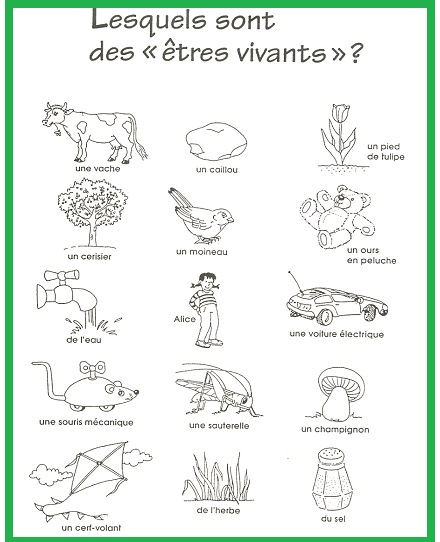
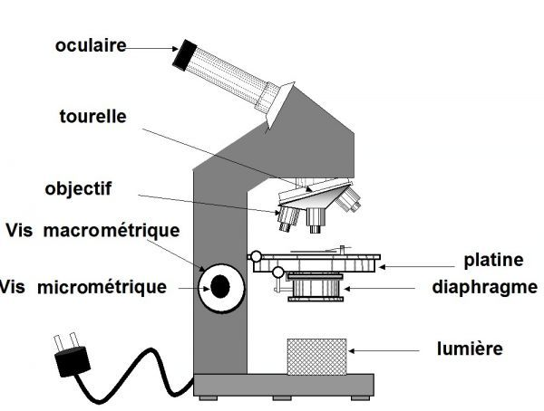

<!-- paginate: true -->
# Module 2

---

# Existe-t-il des différences entre les environnements terrestre et martien ?

---

# Leçon 1 : Tour d'horizon de la Terre

---

## Activité 1 : Qui est "vivant" ? 

--- 

--- 

Esseyons ensemble de contruire la définition d'être vivant. 

---

Un être **vivant** **vit** et **meurt**. 

Un organisme vivant est capable de **respirer**, de se **nourrir**, de **grandir** et de se **reproduire**. 

Certains peuvent se déplacer.
 
---

## Activité 2 : Sortie

Nous allons aller dehors, le but est de noter tout ce que nous voyons. 

En groupe de 3

--- 
Suite à la sortie, remplissons le tableau : 

\ | Êtres vivants | Minéral | Traces de l'activités humaine | 
--- | --- | --- | ---
Cours de récréation | | | | 
Mare | | | |

---

Bilan : on distingue dans notre environnement 3 composantes :
– **les êtres vivants et leurs restes** (fourmis, empreintes de pas, pissentilts, plumes)
– **la composante minérale**(eau, terre, roche, air)
– **les traces de l’activité humaine** (bâtiments, routes, voiture…)

---
 
## Activité 3 : Réalisation d'un herbier de classe

---

Fiche : comment faire un herbier

--- 

Nous allons réaliser un herbier de classe, pour la prochaine séance, tout le monde va rammener une ou deux feuilles, ou des plantes, des fleurs... 

> Attention, on ne prend pas des feuilles ou des fleurs sans demander la permission aux propriétaires des plantes (parents, mairie, collège...)

--- 

Pour reconnaitre les plantes, nous utiliseront l'application PlantNet. 

--- 

# Leçon 2 : Les plantes

---

---

Afin de mieux comprendre les plantes et les êtres vivants, nous allons les regarder de plus près. 

--- 

## Le microcope

--- 
### Découvrons le microscope

---

---

### Définitions

<u>oculaire : </u> C'est une lentille grossisante, c'est l'endroit où l'on regarde, il n'est pas necessaire de poser l'oeil dessus. 

<u>tourelle  : </u> c'est un revolver qui tourne, ce qui permet me mettre plusieurs objectifs, pour grossir plus ou moin. 

<u>objectif :</u>  c'est une lentille grossissante

<u>platine :</u> là où l'on pose la lame mince

---

<u>diaphragme :</u> permet de faire passer plus ou moins de lumière

<u>vis macrométrique :</u> vis permettant de farie monter ou descendre la platine grossièrement, cm par cm.

<u>vis micrométrique :</u>  vis permettant de faire monter ou descendre precisement la platine, mm par mm. 

<u>source lumineuse :</u> afin d'observer à travers la lame mince, il faut obligatoirement une source lumineuse. 

---
## Se servir du microscope

--- 

[Lien pour animation](https://www.pedagogie.ac-nantes.fr/html/peda/svt/microscope/page1.html)

<iframe width="1100" height="800" src="https://www.youtube.com/embed/NQ99dVXP9Is" title="YouTube video player" frameborder="0" allow="accelerometer; autoplay; clipboard-write; encrypted-media; gyroscope; picture-in-picture" allowfullscreen></iframe>

---

## Faire un dessin d'observation

---

# Leçon 3 : La cellule

---

## Observation d'une lame mince d'épiderme d'oignon

Voir TP

--- 

