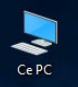
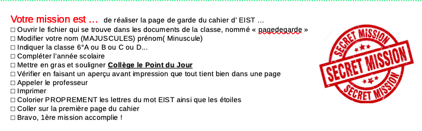
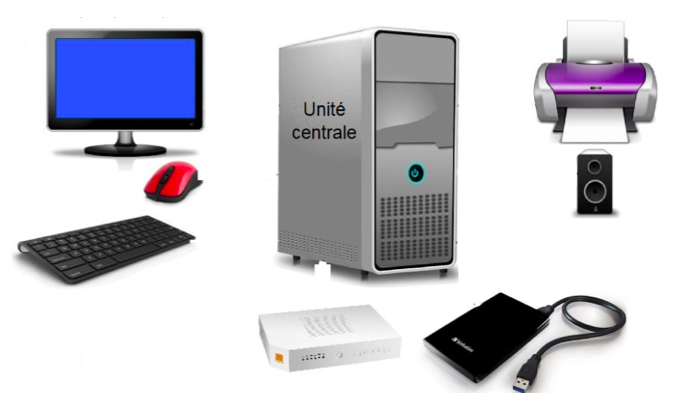
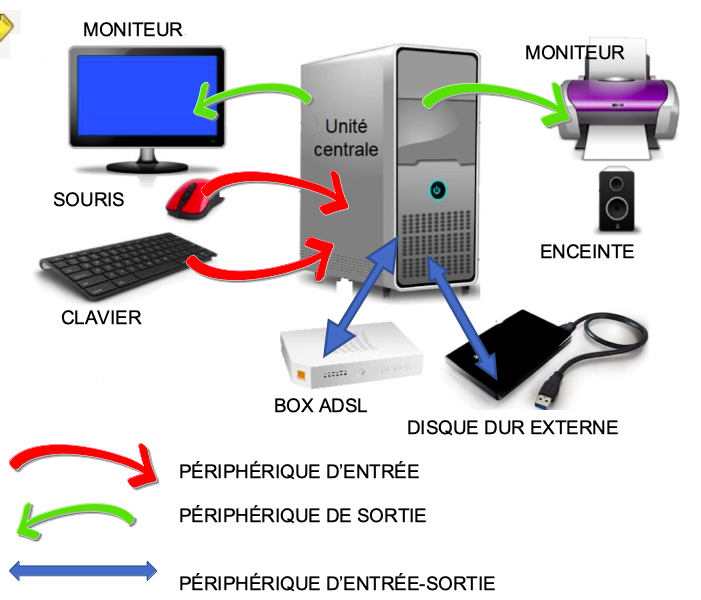

<!-- paginate: true -->
# Cours d'EIST

*Collège Le Point du Jour*

**Aucune reproduction**

Mme LERDU
Mme MALNATI
M BINET
M COLLET

---

# Chapitre 2

## Comment retrouver le fichier bingo dans les ordinateurs du collège ?

---

## 1. Nos idées ?

---

## Les indices

---

---

## 2. Activités

---

### **Retrouvez le fichier « bingo »**

---

### **Écrire en quelques lignes comment vous avez procédé ?**

---

---

## 3. Je retiens

### a) le réseau du collège

Les ordinateurs du collège sont reliés entre eux en réseau. Un réseau est un ensemble d’ordinateurs reliés entre eux de manière à partager des ressources.

Pour se connecter, chaque utilisateur a besoin d'un :

- **nom utilisateur appelé identifiant**

- **mot de passe**

---

### b) Différencier fichier et dossier

<iframe width="1100" height="750" src="https://www.youtube.com/embed/HdXTitjW1Y0" title="YouTube video player" frameborder="0" allow="accelerometer; autoplay; clipboard-write; encrypted-media; gyroscope; picture-in-picture" allowfullscreen></iframe>

---

Un fichier est un document informatique.

Il peut contenir du *texte*, des *images*, du *son*, de la *vidéo*, des *programmes*, représentant chacun un format de fichier différent.

**Un dossier peut contenir des fichiers et/ou des dossiers.**

---

En cours de EIST, tous les fichiers de travail se trouvent dans :  

>L:\6E\EIST

Ils sont en lecture seule : **on ne peut pas les modifier**. 
Pour les modifier il faut les enregistrer dans son propre dossier appelé : 

>Nom/Mes documents. 

---

### c) Les extensions de fichiers

- Nous avons remarqué qu’il y avait 2 fichiers « bingo »

- L’un d’eux n’était pas le bon pourtant il portait le même nom !

- Ce qui les différencie est **leur extension.**

bingo **.odt** et bingo **.jpg**

---

En informatique, une extension de fichier,

Elle indique à l’ordinateur le nom du logiciel.

    bingo.odt → LibreOffice

    bingo.jpg → Logiciel de visionneuse d’images

---

### d) les périphériques

- Retrouver le fichier « peripheriques »

- Ouvrir ce fichier

- Réaliser les 2 activités proposées

- Appeler le professeur pour Imprimer, puis coller l'activité n°2

---

    

---

---

## 4. Le robot perdu

---

[Retour à la liste des leçons](../index.html)

