<!-- paginate: true -->
# Cours d'EIST

*Collège Le Point du Jour*

**Aucune reproduction**

Mme LERDU
Mme MALNATI
M BINET
M COLLET

---

# Module 1 : La planète Terre dans le système solaire

---

# Chapitre 3 : Où se situe la Terre dans le système solaire ?

---

## 1. Mise en situation

---

Quels sont les objets que l’on peut voir dans le ciel ?

N’y a-t-il que la Terre qui tourne autour du Soleil ?

 

**Représenter sous la forme d’un dessin, schéma, ce que vous savez de l’Univers.**

---

## 2. Activité

--- 

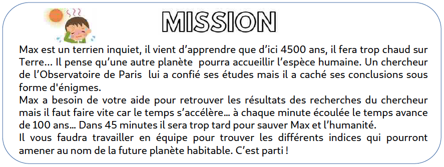

---

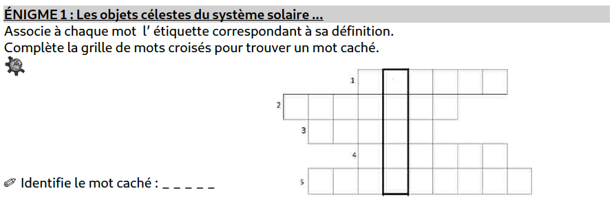

---

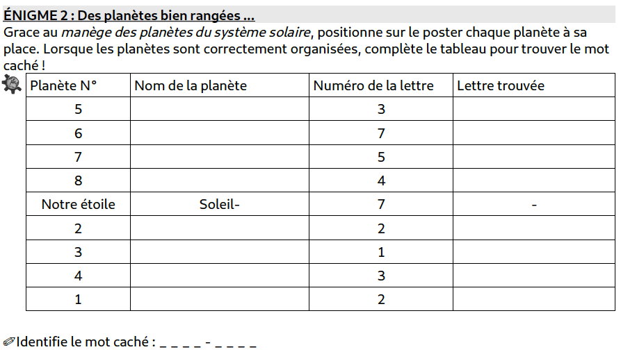

---
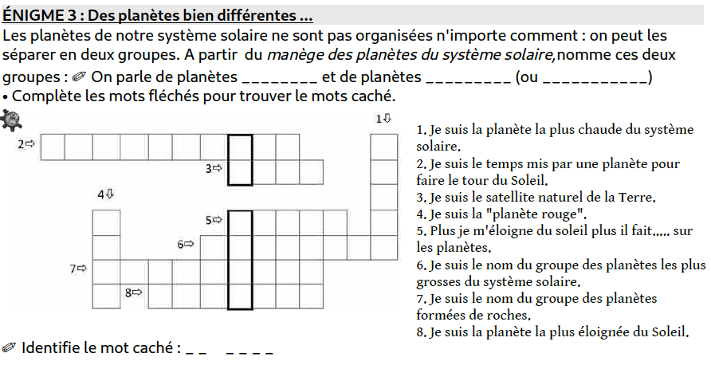

---
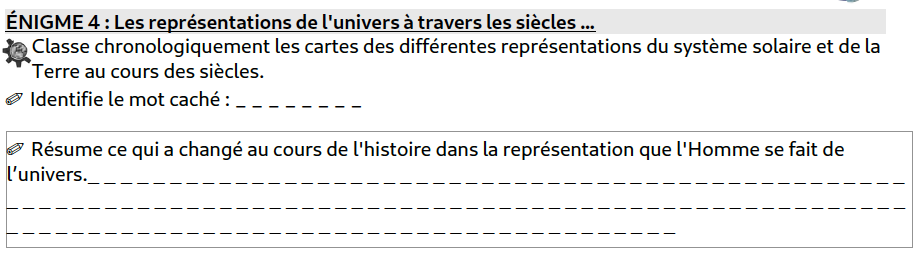

---
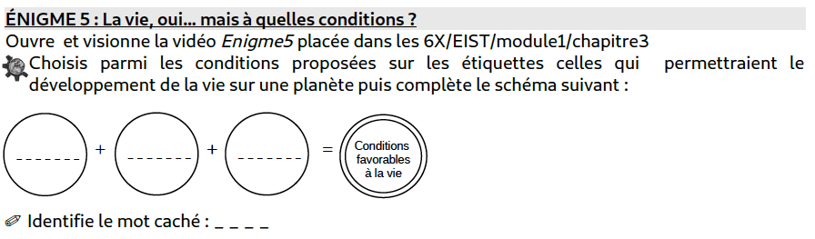

---

<video controls width=1100 height=800>
<source src="enigme5.mp4" type="video/mp4">
</video>

---

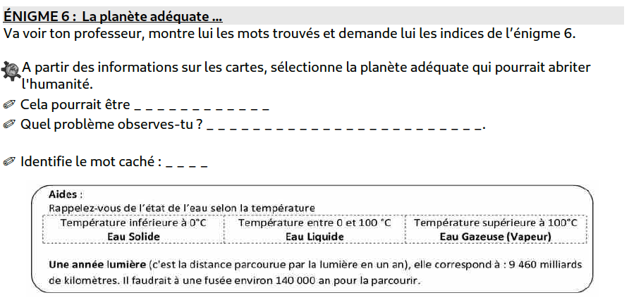

---

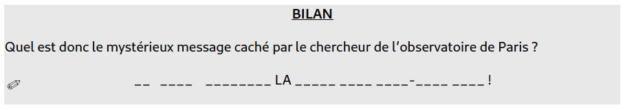

---

[Document PDF](Activite.pdf)

---

## Correction

---

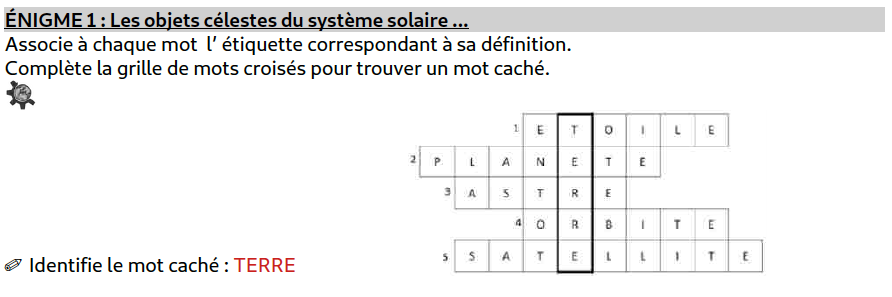

---

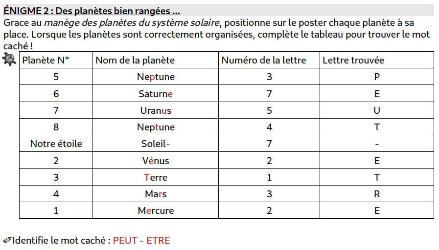

---

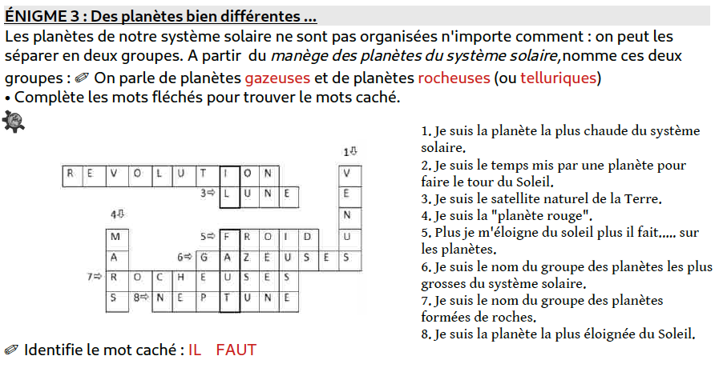

---

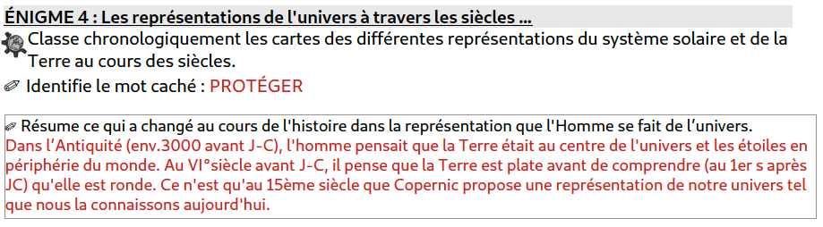

---

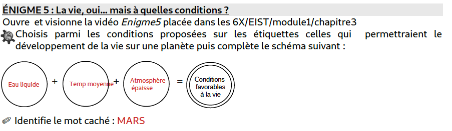

---

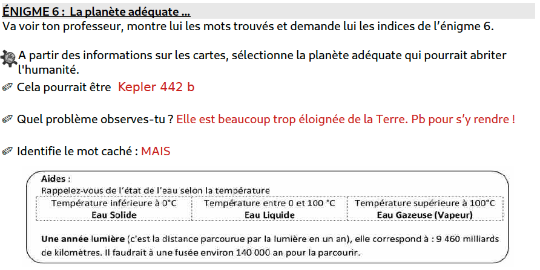

---

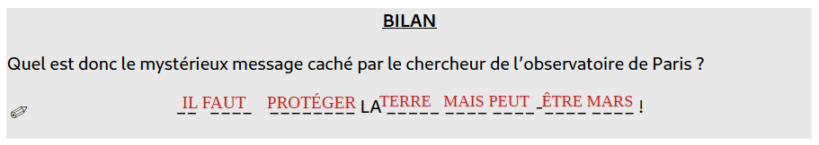

---

[Document PDF](Activitec.pdf)

---

<iframe width="1200" height="800" src="https://www.youtube.com/embed/9IkT7L0PyVE" title="YouTube video player" frameborder="0" allow="accelerometer; autoplay; clipboard-write; encrypted-media; gyroscope; picture-in-picture" allowfullscreen></iframe>

---

## 3. Je retiens

---

Le système solaire est constitué :
- du **Soleil**
- de nombreux autres **astres** qui tournent autour du Soleil.

Une **étoile** est un astre sui produit de la lumière. Le Soleil est une étoile. C’est l’astre le plus gros du système solaire.

---

Une **planète** est un astre lourd et sphérique qui décrit une orbite autour du Soleil. Une planète ne produit pas de lumière.

La **Terre** est la 3ème planète du système solaire.

Autour de certaines planètes tournent un ou plusieurs satellites naturels (ex : la Lune est le satellite naturel de la Terre).

---

Il y a 8 planètes dans le système solaire : 
- Mercure
- Vénus
- Terre
- Mars
- Jupiter
- Saturne
- Uranus
- Neptune

Certaines ont des surfaces solides on les appelle les planètes rocheuses (ou telluriques) d’autres sont des planètes gazeuses.

---

La période de **rotation** correspond à la durée mise par une planète pour faire un tour sur **elle-même** alors que la période de **révolution** est la durée mise pour faire un tour autour du Soleil.

Voici une phrase pour te souvenir de l’ordre des planète :

« **M**ais **V**oilà **T**on **M**artien **J**uste **S**ous **U**ne **N**avette ! »

---

Par îlot, inventez-en une que vous présenterez à l’oral !

---

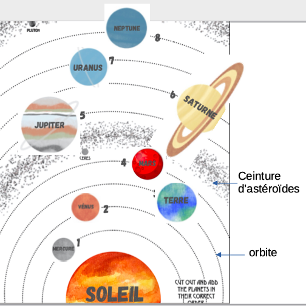

---

## 4. Exercices

---

[Fichier PDF](Exo.pdf)

---

[Retour à la liste des leçons](../index.md)