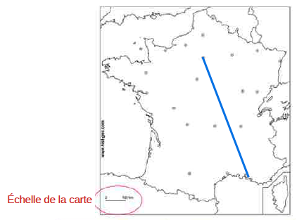
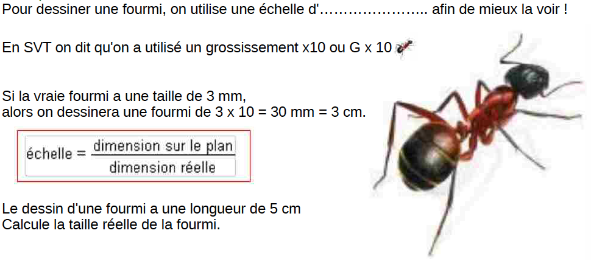
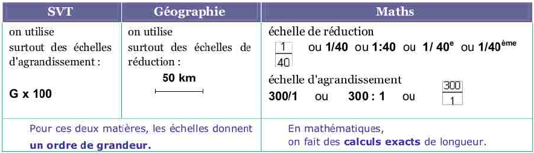

<!-- paginate: true -->
# Cours d'EIST

*Collège Le Point du Jour*

**Aucune reproduction**

Mme LERDU
Mme MALNATI
M BINET
M COLLET

---

# Module 1 : La planète Terre dans le système solaire

---

# Chapitre 4 : Comment réaliser un modèle à l’échelle du système solaire ?  ?

---

## 1. Mise en situation 

Qu’est ce qu’un modèle ? Une maquette ?
Comment faire pour qu’elle corresponde le plus possible à la réalité ?

---

[Activité 1](AC1.pdf)

[Activité 2](AC2.pdf)

---

## 3. Je retiens : NOTION D’ÉCHELLE

---

Il est très difficile de représenter le système solaire car aucune image ne peut être
faite à l’échelle. Si les distances sont respectées, les planètes seront trop petites
pour être vues.

Si la taille des planètes est respectée alors les distances entre les planètes seront
beaucoup trop grandes pour entrer dans une image.

---

Dans le 1er modèle étudié, le Soleil ne serait qu’une sphère de 6 mm de diamètre,
Jupiter, la plus grosse planète ne ferait que 0,6mm et donc la Terre serait presque
invisible !

Dans le 2ème modèle, il faudrait 87 kg de pâte à modeler pour représenter le
Soleil qui ferai environ 1 mètre de diamètre !
La lune y serait presque invisible !

---

En géographie, en SVT, en Technologie et en mathématiques on utilise des échelles bien
différentes :

- Une échelle de **réduction** permet de représenter un objet dont les dimensions réelles sont trop grandes.
- Une échelle d'**agrandissement**

---
###  Exemple 1 : La carte de France

Pour représenter la France sur une feuille,
on utilise une échelle de **réduction.**
Le segment qui mesure 1 cm représente
100 km dans la réalité ; on convertit 100 km
en centimètres c'est-à-dire : 100 km = 10 000 000 cm
et donc l'échelle de la carte est 1 : 10 000 000

---

---

### Exemple 2 : la fourmi 

---

--- 

---

[Activité 2](AC2.pdf)
