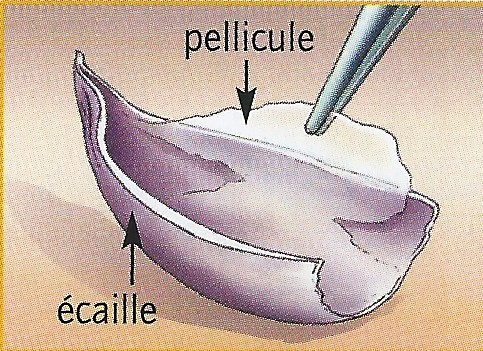
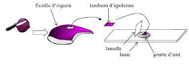
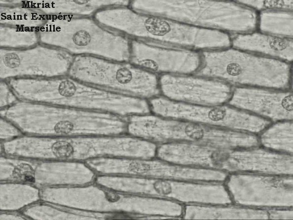

# Observation microscopique de l'épiderme d'oignon

## Matériel : 

- Un microscope optique par élève
- Lames, lamelles, pinces, ciseaux
- Fiche technique : « utilisation du microscope optique »
- Un oignon rouge

## Comment faire ? 

1. Utilise une pince pour soulever un fragment de la « peau » transparente (appelé épiderme) dans le creux d’une écaille

2. Coupe avec une paire de ciseaux un petit morceau de cet épiderme
   
3. Dépose une goutte d'eau sur une lame de verre en respectant les consignes de sécurité
   
4. Dépose le morceau d’épiderme dans la goutte sans faire de plis
   
5. Recouvre d’une lamelle

   
6. Dépose la préparation sur la platine du microscope
   
7. Observe la préparation et repère les cellules de l’oignon au faible grossissement (rouge x4)
   
    >Appelle le professeur pour vérifier l’observation

8. Fais maintenant la mise au point au grossissement suivant (jaune x10)

    >Appelle le professeur pour vérifier l’observation

Tu devrais observer ceci : 

