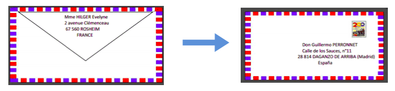
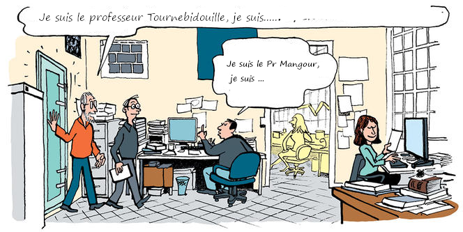
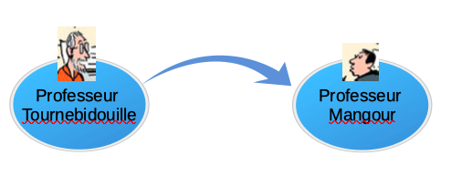
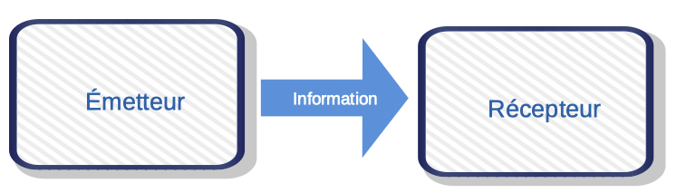

<!-- paginate: true -->
# Cours d'EIST

*Collège Le Point du Jour*

**Aucune reproduction**

Mme LERDU
Mme MALNATI
M BINET
M COLLET

---

# L’EIST c'est quoi ???

---

L’EIST c’est l’...

**E**nseignement

**I**ntégré de

**S**cience et

**T**echnologie

---

Un seul prof pour les 3 matières : 

* Sciences de la Vie et de la Terre

* Physique et Chimie

* Technologie

--- 

C’est un modèle d’enseignement des sciences qui consiste à associer les sciences expérimentales (sciences physique et chimique et sciences de la vie et de la terre) à la technologie.

---

## Matériel

* 1 cahier

* Trousse « bien garnie », crayons de couleur

---

# Chapitre 1:

# Comment peut-on faire pour communiquer ?

--- 

## 1 – Je me questionne ...

Tous les jours, nous communiquons entre nous.

Selon toi, qu’est-ce que ça veut dire «communiquer»?

---

Communiquer c’est « dire » quelque chose

à quelqu’un.

C’est lui **transmettre une information**.

---

## 2 – Activités :

### a) Les moyens de communiquer

Quels sont les différents moyens que l’on peut utiliser

pour communiquer avec quelqu’un ? Trouves-en au

moins 3.

- ex : téléphoner (utilise un verbe à l’infinitif)

- ... ?

- ... ?

- ... ?

--- 

#### Voici quelques exemples :

* Écrire une lettre

* Téléphoner

* Envoyer un mail

* Parler avec quelqu’un

* Utiliser le langage des signes

* Regarder un témoin lumineux

* Observer un panneaux...

---

### b) L’enveloppe mystère ...

Si on fait une analogie avec un courrier postal, celui qui envoie le courrier est l’expéditeur, celui qui le reçoit est le destinataire.

Pour un message oral ou informatique, on utilisera le terme **émetteur** pour l’expéditeur et **récepteur** pour le destinataire.

---

Professeur Tournebidouille communique à Professeur Mangour

---

### c) Questions

a) Qui est l’émetteur ?

b) Qui est le récepteur ?

c)Quelle est l’information transmise ?

d) Quelle est la nature du signal ?

---

#### Correction

a) Qui est l’émetteur ?

**Professeur Tournebidouille est l’émetteur.**

b) Qui est le récepteur ?

**Professeur Mangour est le récepteur.**

c)Quelle est l’information transmise ?

**L’information transmise est l’adresse d’une bonne pizzeria sur Beauvais.**

d) Quelle est la nature du signal ?

**C’est un signal est vocal ou sonore.**

---

### d) Schéma de la transmission de l’information :

Réalise un schéma qui représente la transmission de l’information de son émission à sa réception

Ton schéma doit comporter celui qui envoie, celui qui reçoit et le trajet de l’information.

--- 

Corrige et complète ...

---

---

## 3 – Je retiens :

La **communication** est l’action de transmettre une **information**.

On peut également communiquer à distance avec par exemple,

des objets techniques comme le téléphone, un ordinateur

L’**émetteur code l’information** suivant un langage.

Le **récepteur décode** le langage pour comprendre **l’information**.

---

La communication se fait selon le schéma suivant :

    

---

[Retour à la liste des leçons](../index.html)

