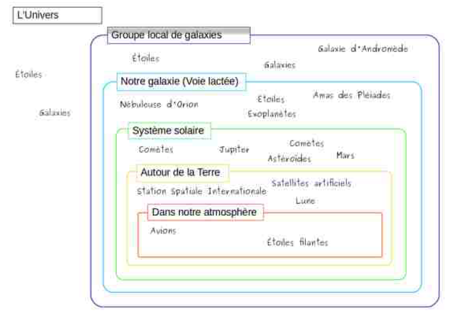
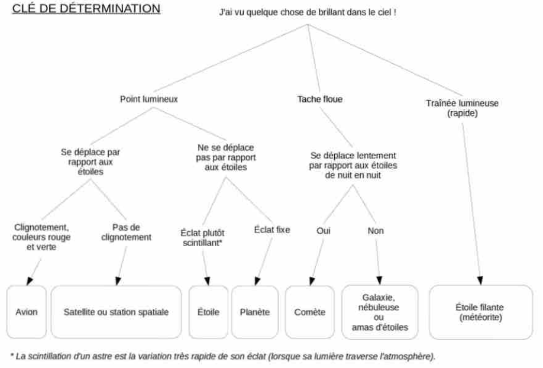

<!-- paginate: true -->
# Cours d'EIST

*Collège Le Point du Jour*

**Aucune reproduction**

Mme LERDU
Mme MALNATI
M BINET
M COLLET

---

# Module 1 : La planète Terre dans le système solaire

---

# Chapitre 5 : Que voit-on la nuit depuis la Terre ?

--- 

## 1.  Mise en situation

**On envisage une soirée d'observation astronomique.**

Par îlots, établir une liste de tout ce que l'on pourra voir dans le ciel nocturne.

---

## 2. Activité 

[Activité](AC1.pdf)

[Un peu d'aide](AideAC.pdf)

---

[Correction de l'activité](AC1c.pdf)

---

## 3 . Je retiens : les constellations

Lorsque l'on observe le ciel étoilé, les "*formes*" que l'on a tendance à imaginer entre les étoiles, appelées "**constellations**", ne sont pas fixes. 

Ces étoiles n'ont pas de lien entre elles et sont parfois situées très loin les unes des autres.

---

Si l'on se déplaçait dans notre galaxie, bien au-delà du système solaire, on verrait d'autres regroupements d'étoiles et on ne reconnaîtrait plus "nos" constellations, déformées par la perspective.

--- 

--- 

