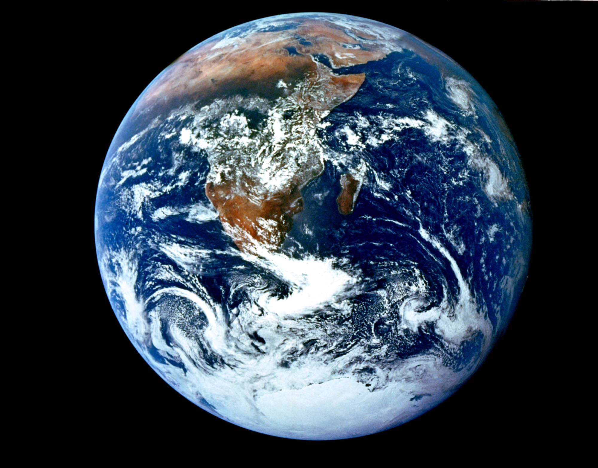
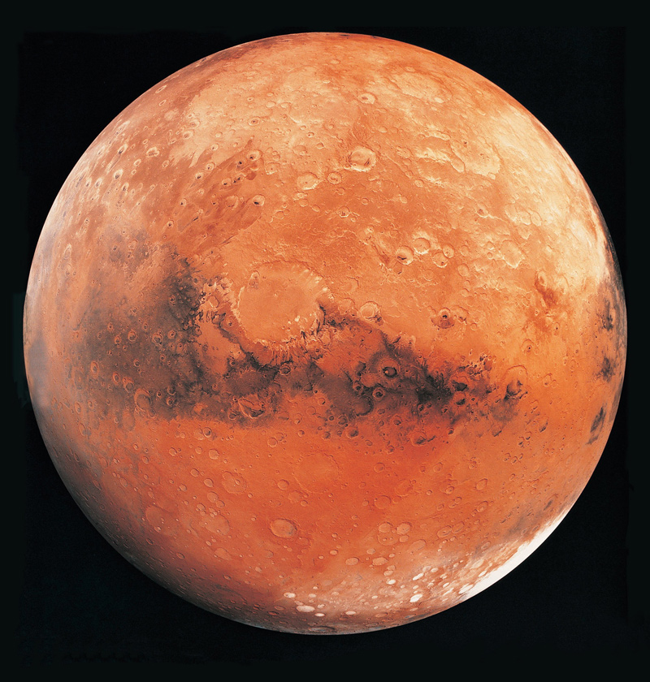
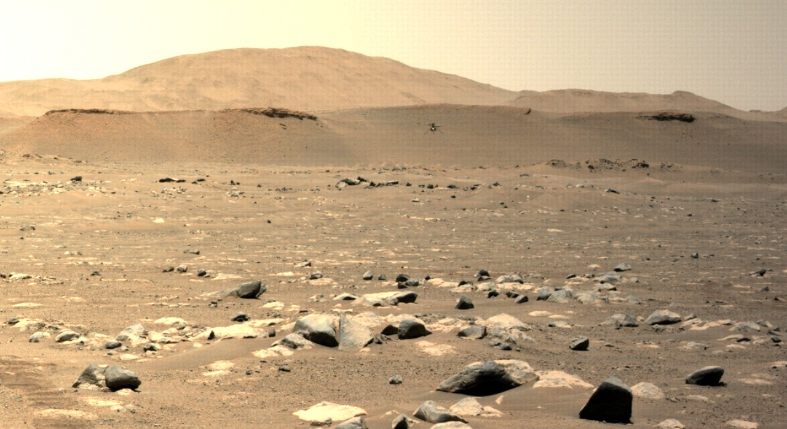
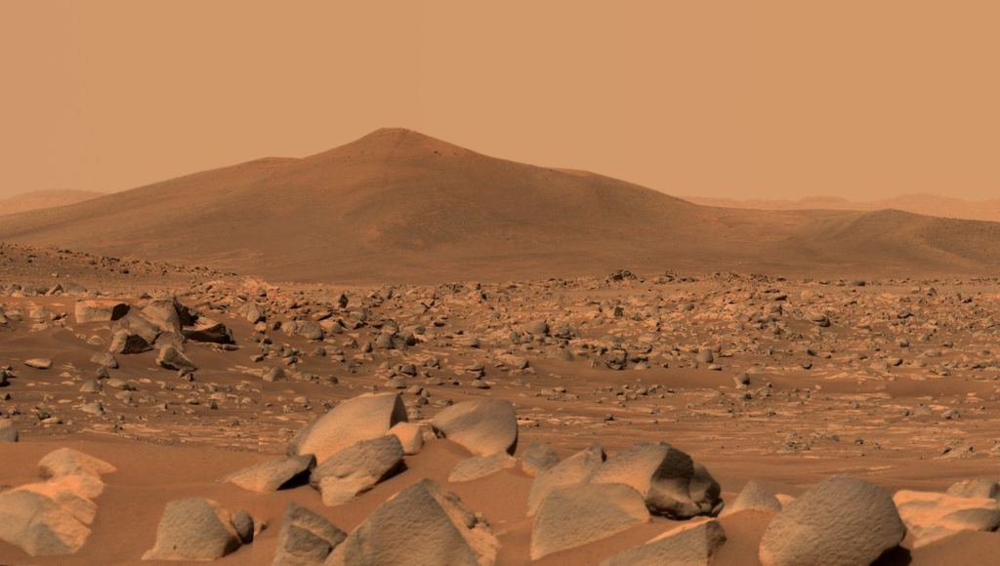
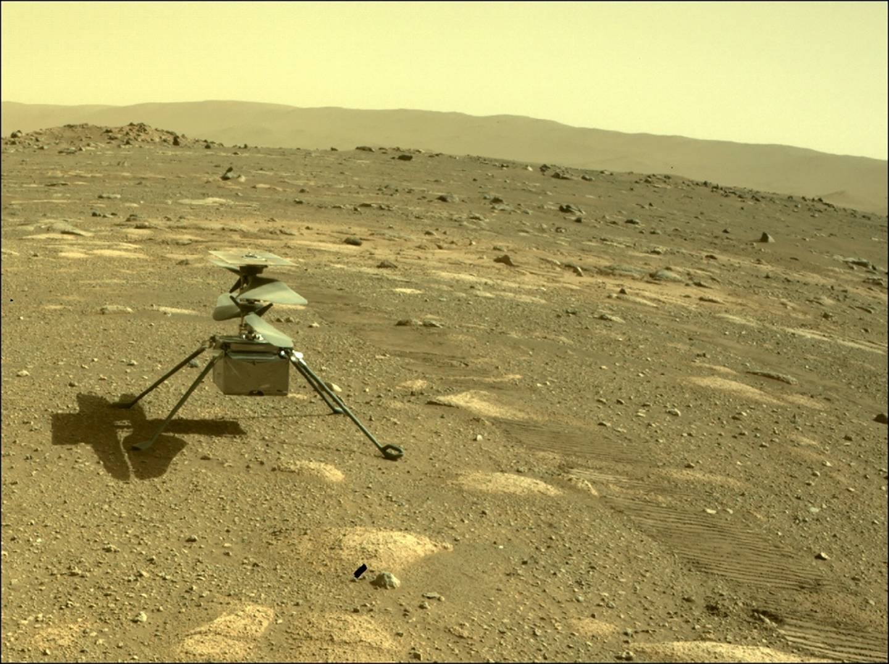
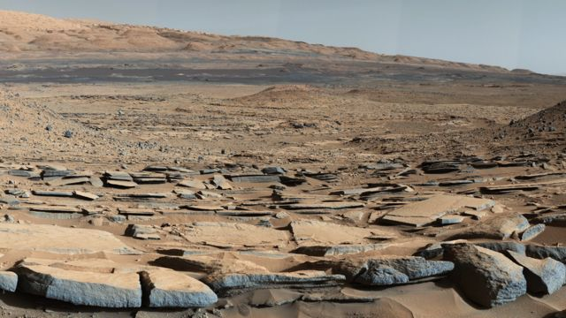

<!-- paginate: true -->
# Cours d'EIST

*Collège Le Point du Jour*

**Aucune reproduction**

Mme LERDU
Mme MALNATI
M BINET
M COLLET

---

# Module 2

---

# Existe-t-il des différences entre les environnements terrestre et martien ?

---

# Chapitre 10 : Mars, planète habitable ? 

---

---

---

--- 

---

---

D'après ce que nous avons vu depuis le début de l'année, quelles sont les conditions indispensable à la vie ? 

---

Mars répond t-elle a ces caractéristiques ? 

