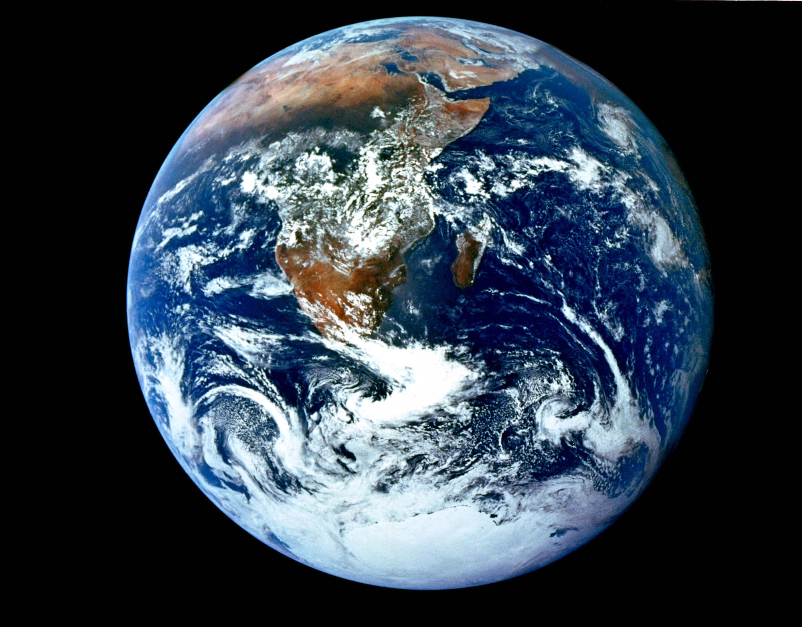

<!-- paginate: true -->
# Cours d'EIST

*Collège Le Point du Jour*

**Aucune reproduction**

Mme LERDU
Mme MALNATI
M BINET
M COLLET

---

# Module 2

---

# Existe-t-il des différences entre les environnements terrestre et martien ?

---

# Chapitre 7 : Les plantes

---

---

Afin de mieux comprendre les plantes et les êtres vivants, nous allons les regarder de plus près. 

--- 

## Le microscope

--- 

### Découvrons le microscope

---

---

### Définitions

<u>oculaire : </u> C'est une lentille grossissante, c'est l'endroit où l'on regarde, il n'est pas nécessaire de poser l'oeil dessus. 

<u>tourelle  : </u> c'est un revolver qui tourne, ce qui permet me mettre plusieurs objectifs, pour grossir plus ou moins. 

<u>objectif :</u>  c'est une lentille grossissante

<u>platine :</u> là où l'on pose la lame mince

---

<u>diaphragme :</u> permet de faire passer plus ou moins de lumière

<u>vis macrométrique :</u> vis permettant de faire monter ou descendre la platine grossièrement, cm par cm.

<u>vis micrométrique :</u>  vis permettant de faire monter ou descendre précisément la platine, mm par mm. 

<u>source lumineuse :</u> afin d'observer à travers la lame mince, il faut obligatoirement une source lumineuse. 

---

## Se servir du microscope

--- 

[Lien pour animation](https://www.pedagogie.ac-nantes.fr/html/peda/svt/microscope/page1.html)

---

<iframe width="1100" height="800" src="https://www.youtube.com/embed/NQ99dVXP9Is" title="YouTube video player" frameborder="0" allow="accelerometer; autoplay; clipboard-write; encrypted-media; gyroscope; picture-in-picture" allowfullscreen></iframe>

---

## Bilan

Le microscope est un **instrument** permettant de **grossir** l’image d’un échantillon mince traversé par la lumière.

---

---

## Un autre outil d'observation : la loupe binoculaire. 

---

---

Une **loupe binoculaire** est un outil permettant de grossir les objets, mais contrairement au microscope, il n'est pas nécessaire que la lumière traverse l'objet, il s'agit de regarder la surface de l'objet. 

---

---

## Faire un dessin d'observation

---

[Fiche](../Documents%20élèves/fiche%20dessin.pdf)

---

Voici à quoi doit ressembler votre feuille à dessin avant de commencer. 
Il faut prendre une feuille blanche, format A4. 

---

Le cadre extérieur est à faire à 2 cm du bord de la feuille. Le cartouche fait 5 cm de haut, et la case à droite, fait également 5 cm. 

---

Le dessin se fait au centre de la feuille, sans couleur, uniquement au crayon, les légendes se trouvent au bout de traits horizontaux, qui pointent précisément. 

---

Le titre se met dans le cartouche en bas de la feuille, la case de droite permet d'y mettre des informations sur l'observation, comme la coloration, le grossissement... 

---
