# Relation Proie / Prédateur

## Définitions 

**Proie** : Animal chassé par un prédateur. 

**Prédateur** : Espèce qui va se nourrir d'un autre animal (Proie)

## Relation entre le Lynx et le lièvre

> On sait que le lynx se nourrit à 95% de lièvres.

On observe que de manière recurrente, les populations de lynx et de lièvres augmentent puis diminuent. Quand la population de lièvres augmente, **alors** la population de lynx augmente aussi.

Une fois que la population de lynx est haute, on observe que la population de lièvre **diminue**. Ce qui entraine par la suite une **diminution** de la population de lynx. 

Puis le cycle recommence. 

